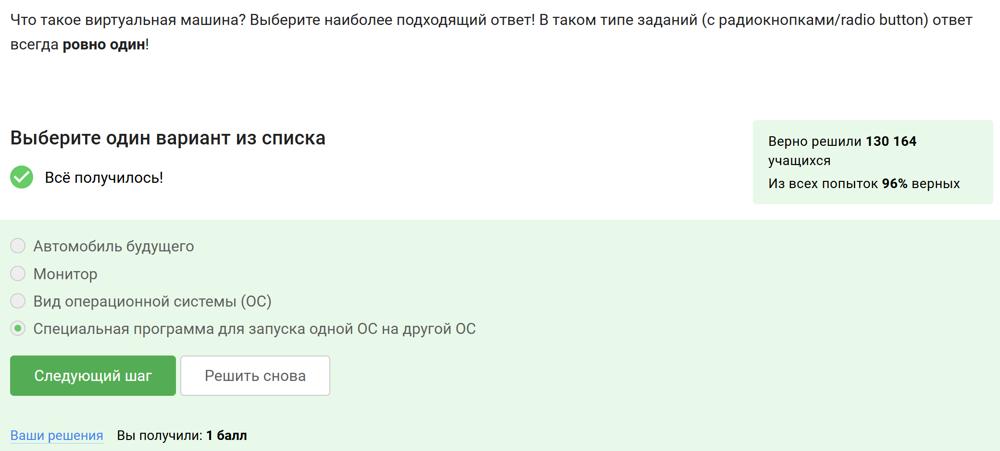
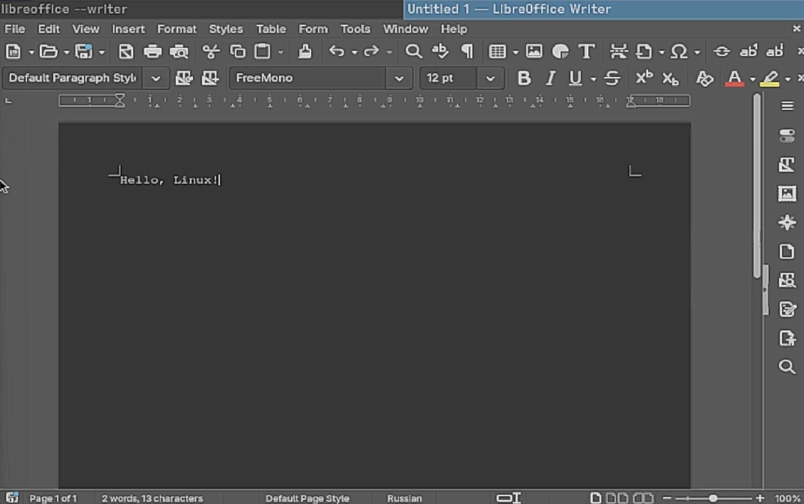
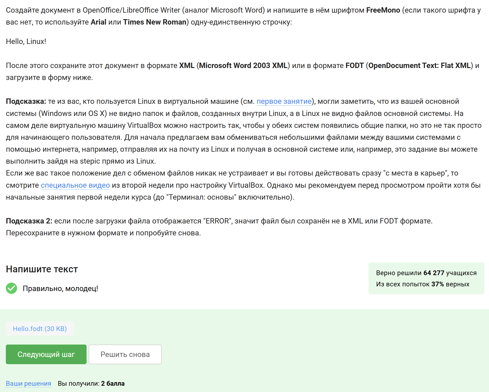
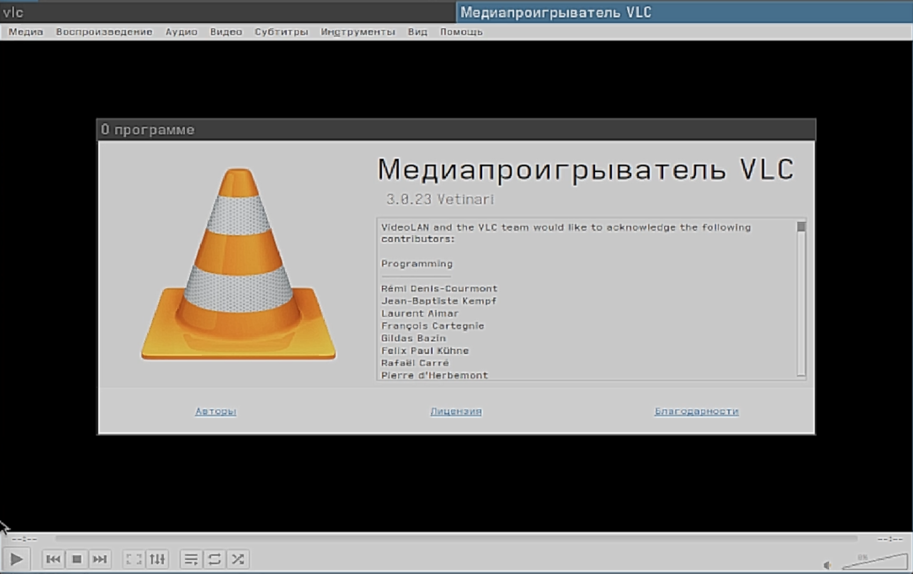
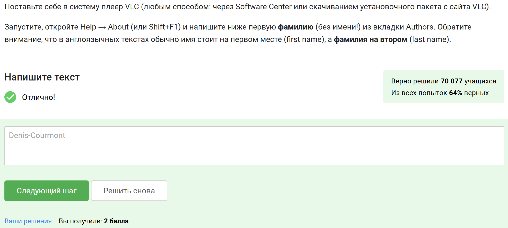
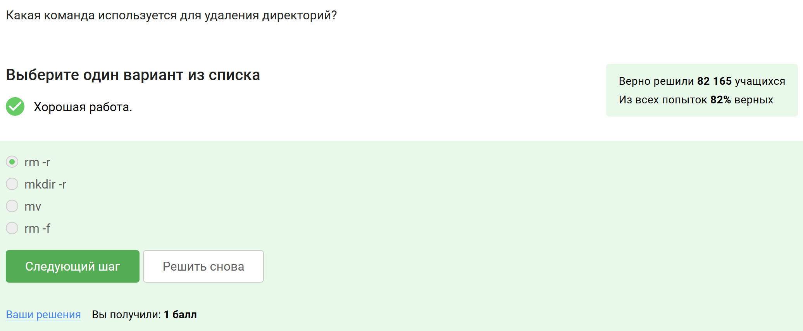
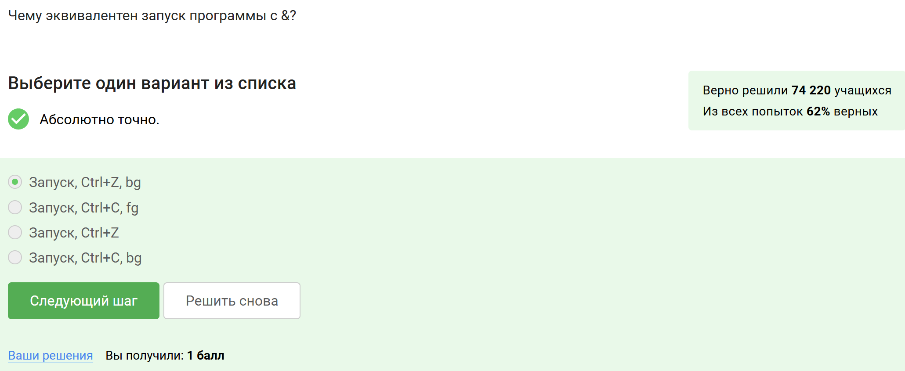
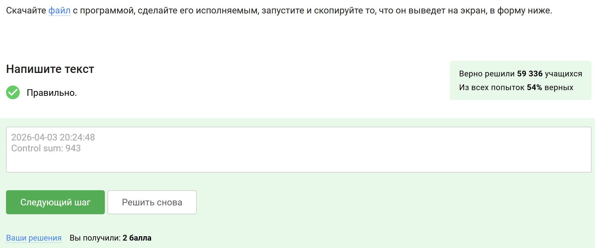
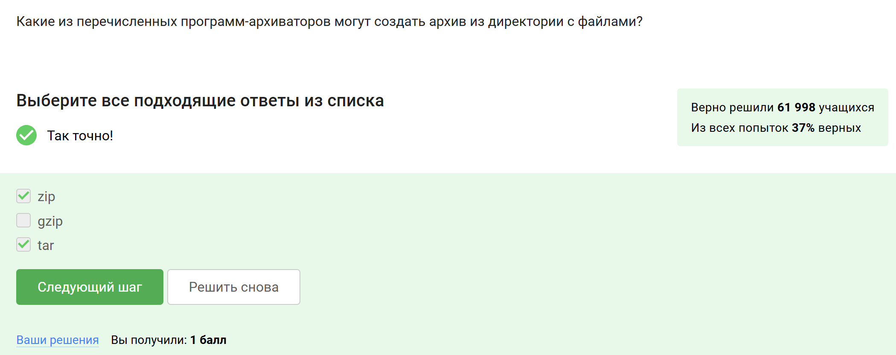
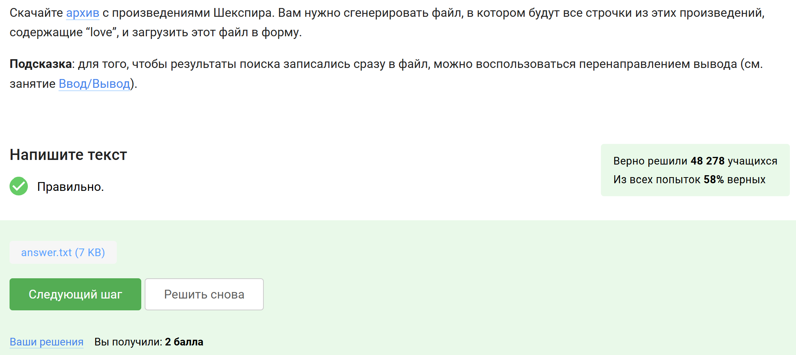

---
## Author
author:
  name: Сачковская София Александровна
  email: 1132259310@rudn.ru
  affiliation:
    - name: Российский университет дружбы народов
      country: Российская Федерация
      postal-code: 117198
      city: Москва
      address: ул. Миклухо-Маклая, д. 6
## Title
title: Внешний курс 1 этап
subtitle: Архитектура компьютеров и операционные системы
license: CC BY
date: today
date-format: "YYYY-MM-DD" # Example: 2025-09-06
lang: ru
format:
  beamer:
    pdf-engine: xelatex
    theme: Madrid
    colortheme: dolphin
    aspectratio: 169
  revealjs:
    theme: simple
    slide-number: true
mainfont: "Liberation Serif"
sansfont: "Liberation Sans"
monofont: "Liberation Mono"
---

# Информация

---

## Докладчик

:::::::::::::: {.columns align=center}
::: {.column width="70%"}

  * Сачковская София Александровна
  * студентка НКАбд-06-25
  * Российский университет дружбы народов им. П. Лумумбы
  * [1132259310@rudn.ru](mailto:1132259310@rudn.ru)
  * <https://github.com/sachkovskayasofia>

:::
::: {.column width="30%"}

 

:::
::::::::::::::

---

# Цель работы

Целью работы является прохождение первого этапа внешнего курса «Введение в Linux» и закрепление базовых практических навыков работы в операционной системе Linux, включая использование терминала, выполнение основных команд, работу с вводом и выводом, скачивание файлов, архивирование данных и поиск файлов и текста.

---

# Задание

Необходимо пройти задания первого этапа внешнего курса и подготовить отчёт по всем выполненным активностям. Для каждого тестового вопроса и интерактивного задания требуется привести:

- скриншот с формулировкой задания;
- скриншот, подтверждающий успешное прохождение;
- краткое пояснение по выбору ответа или выполнению задания.

---

# Выполнение первого этапа

---

## Общая информация о курсе

---

Указала название курса --- «Введение в Linux» (@fig-001).

{#fig-001 width=80%}

В задании нужно было выбрать название курса из предложенных вариантов, что я и сделала.

---

Прочитала условия прохождения курса и отметил все верные утверждения (@fig-002).

{#fig-002 width=80%}

Были отмечены пункты о самостоятельном выполнении заданий, недопустимости публикации решений и отсутствии дедлайнов.

---

## Как установить Linux

---

Указала, какие операционные системы обычно использую, отметила варианты «Linux» и «Windows» (@fig-003).

{#fig-003 width=80%}

В задании требовалось выбрать все подходящие варианты ответа о том, какие операционные системы используются мной обычно. Были отмечены варианты «Linux» и «Windows».MacOS я использую крайне редко

---

Указала, что виртуальная машина --- это специальная программа для запуска одной операционной системы внутри другой (@fig-004).

{#fig-004 width=80%}

В задании требовалось выбрать один правильный вариант ответа о том, что такое виртуальная машина. Был выбран вариант о запуске одной ОС на другой ОС.

---

{#fig-005 width=80%}

В задании требовалось подтвердить факт запуска Linux на компьютере. Так как система у меня уже давно была успешно запущена, был выбран вариант «Да».

---

## Осваиваем Linux

---

Создала текстовый документ в LibreOffice Writer, ввела строку `Hello, Linux!`, сохранила файл в подходящем формате (@fig-006) и загрузила его в систему (@fig-007).

{#fig-006 width=80%}

{#fig-007 width=80%}

Для выполнения задания был подготовлен документ со строкой `Hello, Linux!`, после чего он был сохранён в нужном формате и успешно загружен, что подтверждается зачётом решения.

---

Указала, что установочные пакеты в Ubuntu имеют расширение `deb` (@fig-008).

{#fig-008 width=80%}

В задании требовалось выбрать расширение установочных пакетов, используемых в Ubuntu. Были рассмотрены предложенные варианты: `exe` относится в основном к Windows, `dmg` --- к macOS, а `txt` и `ubuntu` не являются форматами установочных пакетов. Поэтому был выбран вариант `deb`, который используется в системах семейства Debian.

---

Установила медиаплеер VLC, открыл окно с информацией о программе и определила первую фамилию во вкладке Authors (@fig-009), после чего ввела ответ в систему (@fig-010).

{#fig-009 width=80%}

{#fig-010 width=80%}

В задании требовалось установить VLC, открыть раздел `Help → About` и посмотреть вкладку Authors. Так как в списке авторов сначала указано имя, а затем фамилия, была определена первая фамилия --- `Denis-Courmont`, после чего этот ответ был введён в поле на платформе и засчитан системой.

---

Указала, что приложение Update Manager можно использовать для обновления ссылок в Software Center, обновления установленного программного обеспечения и обновления системы до новой версии (@fig-011).

{#fig-011 width=80%}

В задании требовалось отметить все подходящие варианты использования Update Manager. Были исключены пункты про установку и удаление программ, так как для этого обычно используются другие средства управления пакетами. Остальные варианты связаны именно с обновлением системы и программ, поэтому они и были выбраны.

---

## Terminal: основы

---

Отметила, что синонимами командной строки являются «Терминал» и «Консоль» (@fig-012).

{#fig-012 width=80%}

В задании требовалось выбрать все подходящие названия командной строки. Варианты «Ассоль» и «Термин» не относятся к работе в Linux, поэтому они были исключены. Подходящими вариантами являются «Терминал» и «Консоль», так как именно этими словами обычно называют интерфейс для ввода команд.

---

Указала, что команде `ls -A --human-readable -l /some/directory` полностью эквивалентна команда `ls -lAh /some/directory` (@fig-014).

{#fig-014 width=80%}

В задании требовалось найти полную эквивалентную запись команды `ls` с теми же параметрами. Для этого нужно было сопоставить длинные и короткие опции: `-A` соответствует выводу почти всех файлов без `.` и `..`, `--human-readable` соответствует ключу `-h`, а `-l` --- длинному формату вывода. По этой причине был выбран вариант `ls -lAh /some/directory`, так как он содержит тот же набор параметров, только в сокращённой форме.

---

Указала, что содержимое каталога `/home/bi/Downloads` в данной ситуации можно вывести командами `ls ../Downloads` и `ls ~/Downloads` (@fig-015).

{#fig-015 width=80%}

В задании требовалось определить команды, которые из каталога `/home/bi/Documents` покажут содержимое `/home/bi/Downloads`, не затрагивая другие директории. Команда `ls ../Downloads` подходит, потому что каталог `Downloads` находится на один уровень выше относительно `Documents`. Команда `ls ~/Downloads` тоже подходит, так как символ `~` указывает на домашнюю директорию `/home/bi`. Вариант `ls Downloads` не подходит, потому что в текущем каталоге `Documents` такой папки нет, а `ls /home/bi/Do*` обращается уже не к каталогу `Downloads`, а к путям, начинающимся на `Do`.

---

Указала, что для удаления директорий используется команда `rm -r` (@fig-016).

{#fig-016 width=80%}

В задании требовалось выбрать команду, которая удаляет директории. Вариант `mkdir -r` не подходит, так как `mkdir` используется для создания каталогов, а `mv` --- для перемещения и переименования файлов и папок. Вариант `rm -f` предназначен для принудительного удаления файлов, но сам по себе не удаляет директории. Поэтому был выбран вариант `rm -r`, где ключ `-r` означает рекурсивное удаление каталога вместе с его содержимым.

---

## Запуск исполняемых файлов

---

Указала, что после ввода команд `firefox`, а затем `exit` никто не закроется (@fig-017).

{#fig-017 width=80%}

В задании требовалось определить, что произойдёт при запуске Firefox из терминала и последующем вводе команды `exit`. После запуска браузера терминал обычно ожидает завершения этой программы, поэтому команда `exit` сразу не завершает окно терминала и не закрывает Firefox. По этой причине был выбран вариант, что никто не закроется.

---

Указала, что запуск программы с символом `&` эквивалентен последовательности: запуск программы, затем `Ctrl+Z`, затем `bg` (@fig-018).

{#fig-018 width=80%}

В задании требовалось определить, чему соответствует запуск команды с `&`. Такой запуск сразу переводит процесс в фоновый режим. Аналогичного результата можно добиться, если сначала запустить программу обычным способом, затем приостановить её сочетанием `Ctrl+Z`, а после этого продолжить выполнение в фоне командой `bg`. Поэтому был выбран именно этот вариант.

---

Скачала файл с программой, перешёл в каталог с ним и запустил его, получив на экране дату, время и контрольную сумму.Затем скопировала выведенный текст в форму ответа на платформе (@fig-020).

{#fig-020 width=80%}

В задании требовалось скачать файл с программой, сделать его исполняемым и запустить. После запуска программа вывела результат в терминал, который затем был перенесён в поле ответа. Совпадение выведенного текста и введённого ответа подтверждает правильное выполнение задания.

---

## Ввод / вывод

---

Указала, что по умолчанию поток ошибок программы, запущенной в терминале, выводится на экран (@fig-021).

{#fig-021 width=80%}

В задании требовалось определить, куда по умолчанию направляется поток ошибок. Варианты с файлами `stderr` и `err.txt` не подходят, потому что ошибки записываются туда только при специальном перенаправлении. Вариант «Никуда» тоже неверен, так как сообщения об ошибках отображаются пользователю. Поэтому был выбран ответ «На экран».

---

Указала, что поток ошибок программы `program` можно записать в файл `file.txt` командами `program 2>> file.txt` и `program 2> file.txt` (@fig-022).

{#fig-022 width=80%}

В задании требовалось выбрать команды, которые создадут файл `file.txt` и направят в него именно поток ошибок. Обозначение `2>` используется для перенаправления стандартного потока ошибок, а `2>>` --- для добавления ошибок в конец файла. Так как в условии сказано, что файла ещё нет, обе команды подходят, потому что в этом случае файл будет создан. Остальные варианты либо работают с обычным выводом, либо относятся к вводу, а не к потоку ошибок.

---

Указала, что сообщения об ошибках программ в конвейере по умолчанию выводятся на экран (@fig-023).

{#fig-023 width=80%}

В задании требовалось определить, куда попадает поток ошибок `stderr`, если программы соединены через конвейер. Конвейер передаёт дальше только обычный вывод `stdout`, а поток ошибок с ним не объединяется автоматически. Поэтому сообщения об ошибках не исчезают и не записываются сами по себе в отдельный файл, а продолжают выводиться на экран.

---

## Скачивание файлов из интернета

---

Указала, что после выполнения этих команд картинка окажется в файле `/home/alex/1.jpg` (@fig-024).

{#fig-024 width=80%}

В задании требовалось определить, куда именно будет сохранён файл. Ключ `-O 1.jpg` задаёт имя выходного файла, а команда `cd /home/alex/` перед этим переводит в домашний каталог пользователя. Поэтому файл сохраняется как `/home/alex/1.jpg`. Ключ `-P /home/alex/Pictures` здесь не влияет на итоговое имя файла, так как оно уже явно задано через `-O`.

---

Указала, что для отключения всех сообщений на экране в `wget` используется опция `-q` или `--quiet` (@fig-025).

{#fig-025 width=80%}

В задании требовалось выбрать опцию, при которой `wget` не выводит служебные сообщения вроде `Resolving` и `Connecting to`. Вариант `-v` наоборот включает подробный вывод, а `-nv` только уменьшает количество сообщений, но не отключает их полностью. Поэтому был выбран вариант `-q` или `--quiet`, который делает работу команды тихой.

---

Указала, что при запуске `wget -r -l 1 -A jpg` будут скачаны `jpg` и `html` файлы, но все `html` затем будут удалены (@fig-026).

{#fig-026 width=80%}

В задании требовалось определить, какие файлы останутся после рекурсивного скачивания страницы с ограничением по расширению. При такой команде `wget` всё равно загружает HTML-страницы, потому что они нужны для перехода по ссылкам, но после завершения работы удаляет их, если они не подходят под условие `-A jpg`. Поэтому в итоге остаются только `jpg`-файлы, а `html`-файлы скачиваются временно и затем удаляются.

---

## Работа с архивами

---

Указала, что `gzip` удаляет архив после его распаковки (@fig-027).

{#fig-027 width=80%}

В задании требовалось определить различие между `gzip` и `zip` при использовании без дополнительных опций. Варианты про степень сжатия не подходят, потому что это зависит от данных и не является главным отличием в таком вопросе. Также неверно, что `zip` удаляет архив после распаковки. Особенность `gzip` в том, что при обычной распаковке исходный `.gz`-файл удаляется, поэтому был выбран именно этот вариант.

---

Указала, что архив из директории с файлами могут создать программы `zip` и `tar` (@fig-028).

{#fig-028 width=80%}

В задании требовалось отметить программы, которые умеют упаковывать директорию целиком. `zip` и `tar` подходят, потому что используются для создания архивов с каталогами и их содержимым. `gzip` не подходит, так как сам по себе обычно сжимает отдельный файл, а не создаёт архив из директории.

---

Указала, что для создания архива `my_archive.tar.bz2` в `tar` нужно использовать набор опций `-cjf` (@fig-029).

{#fig-029 width=80%}

В задании требовалось выбрать опции для упаковки файлов в архив формата `tar.bz2`. Ключ `c` означает создание нового архива, `j` --- сжатие через `bzip2`, а `f` --- указание имени файла архива. Остальные варианты не подходят, потому что `z` используется для `gzip`, а `x` --- для распаковки, а не для создания архива.

---

## Поиск файлов и слов в файлах

---

Указала, что файл `Alexey.jpeg` не будет найден по маскам `*.?`, `alexey.*` и `*.jpg` (@fig-030).

{#fig-030 width=80%}

В задании требовалось отметить маски, которые не подходят для файла `Alexey.jpeg`. Маска `*.?` не подходит, потому что после точки в имени файла не один символ, а четыре — `jpeg`. Маска `alexey.*` тоже не подойдёт, так как в имени файла используется заглавная буква `A`, а поиск чувствителен к регистру. Маска `*.jpg` не подходит, потому что расширение файла — `jpeg`, а не `jpg`.

---

Указала строки, которые содержат подстроку `world` и поэтому будут выведены командой `grep "world" text.txt` (@fig-031).

{#fig-031 width=80%}

В задании требовалось отметить все строки, в которых встречается именно последовательность символов `world`. Поэтому подходят строки, где `world` входит как отдельное слово, как часть другого слова или находится в кавычках. Не подошли варианты `The word is not enough`, `The World Is Not Enough` и `World`, потому что `word` — это другое сочетание букв, а `World` с заглавной буквы не совпадает со строкой поиска, так как `grep` без дополнительных опций учитывает регистр.

---

Скачала архив с произведениями Шекспира, выполнила поиск всех строк, содержащих `love`, и сохранил результат в файл `answer.txt`. Затем загрузила полученный файл на платформу (@fig-033).

{#fig-033 width=80%}

В задании требовалось получить файл со всеми строками из произведений Шекспира, содержащими слово `love`. Для этого был использован поиск по текстовым файлам с перенаправлением вывода в `answer.txt`. После проверки содержимого полученный файл был загружен в форму, и система засчитала решение.

---

# Выводы

В ходе выполнения работы был пройден первый этап внешнего курса «Введение в Linux». В процессе выполнения заданий были закреплены базовые навыки работы с операционной системой Linux и командной строкой.

В рамках этапа были рассмотрены основные сведения о курсе и способах установки Linux, выполнены задания по работе с терминалом, запуску программ, использованию стандартных потоков ввода и вывода, скачиванию файлов из интернета, работе с архивами, а также поиску файлов и строк в текстовых файлах.

По результатам выполнения заданий были освоены основные команды и приёмы работы, необходимые для дальнейшего изучения Linux и выполнения более сложных практических задач.

