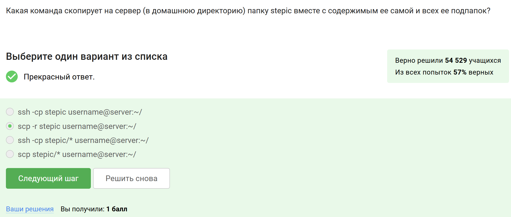
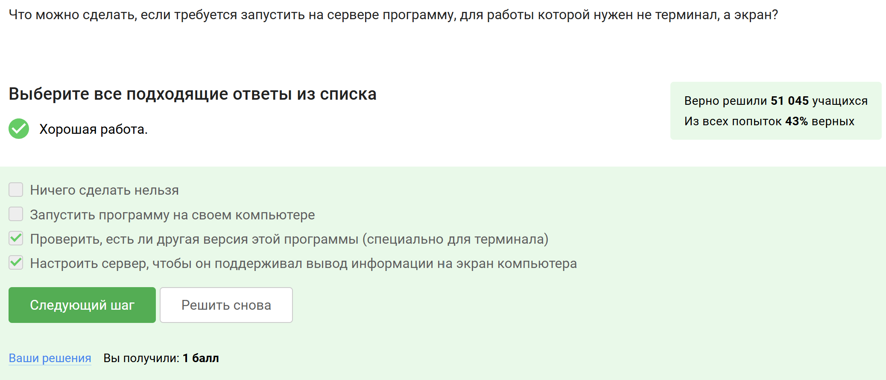
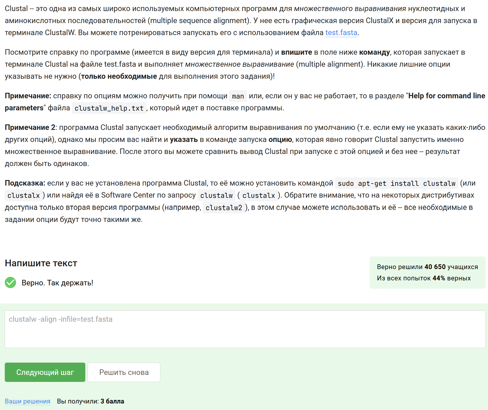
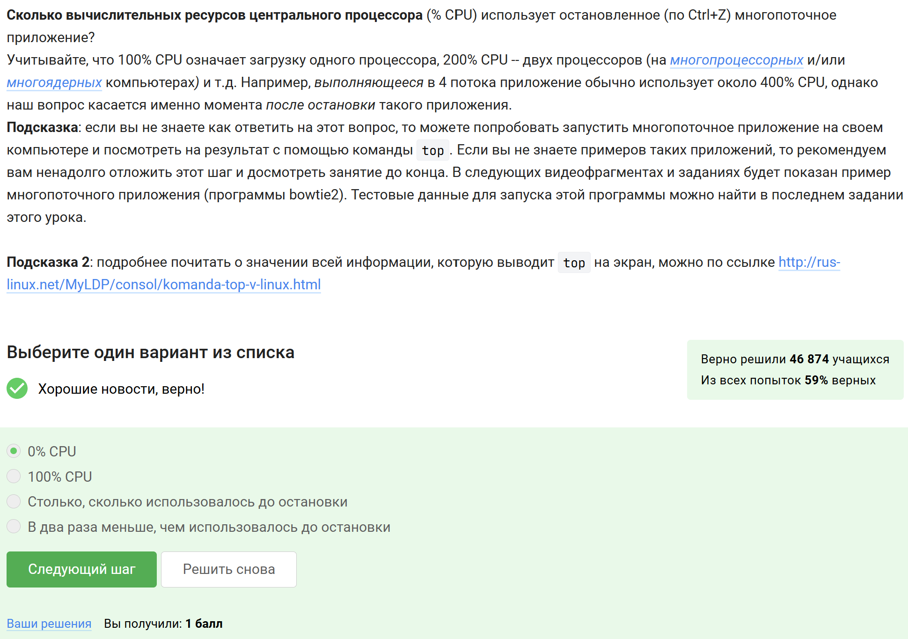
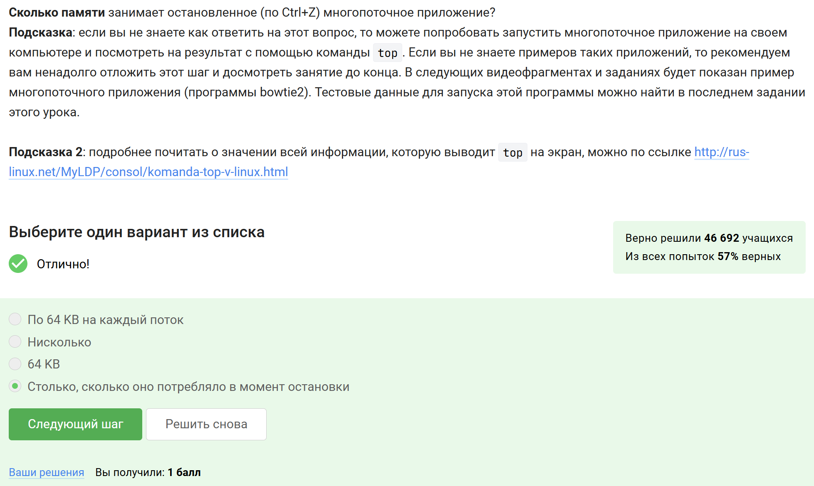
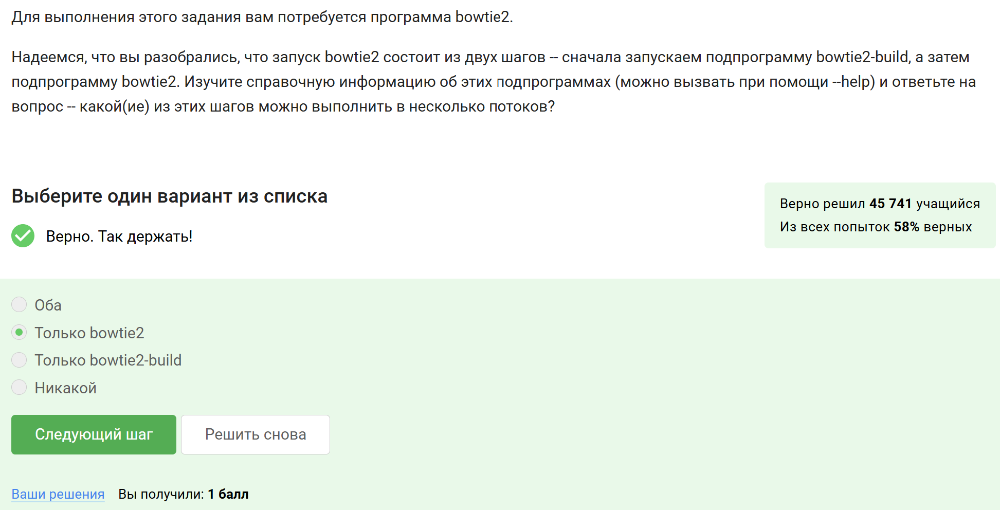
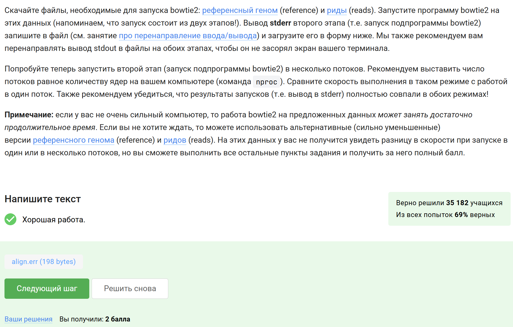
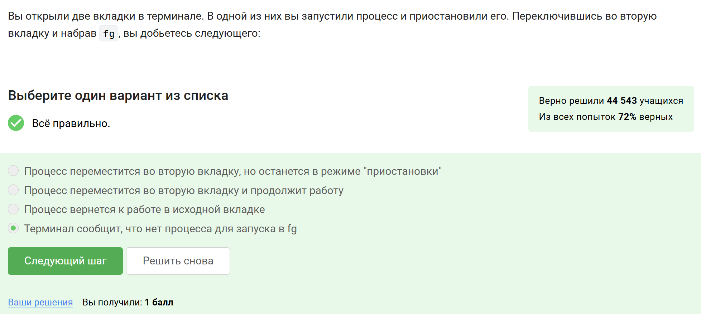
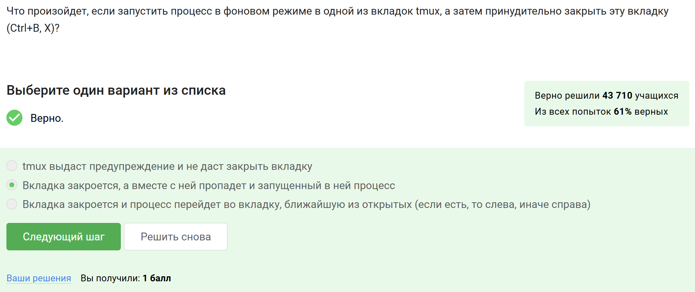
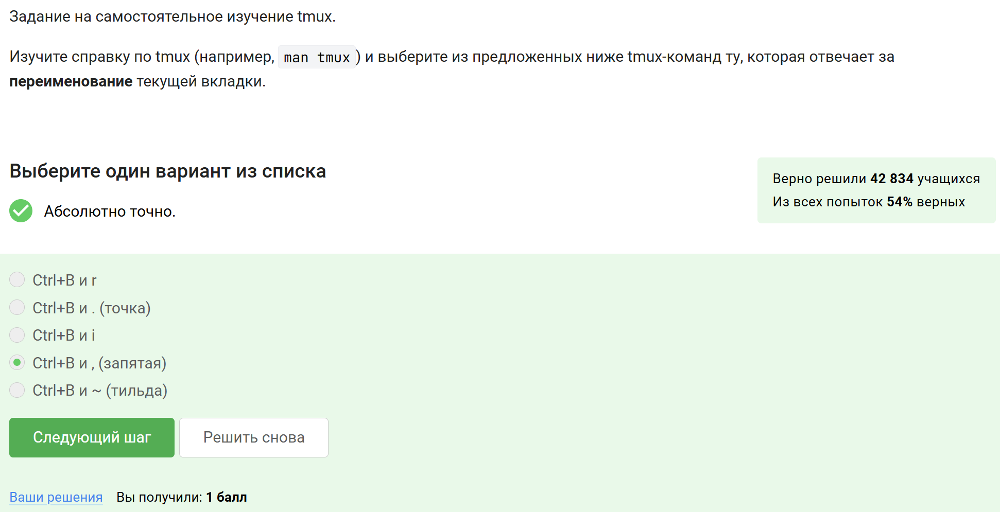

---
## Author
author:
  name: Сачковская София Александровна
  email: 1132259310@rudn.ru
  affiliation:
    - name: Российский университет дружбы народов
      country: Российская Федерация
      postal-code: 117198
      city: Москва
      address: ул. Миклухо-Маклая, д. 6

## Title
title: "Внешний курс 2 этап"
subtitle: "Архитектура компьютера и операционные системы"
license: "CC BY"
---

# Цель работы

Целью работы является прохождение второго этапа внешнего курса «Введение в Linux» и закрепление практических навыков работы с удалёнными серверами, передачей файлов, справочной информацией о программах, управлением процессами, многопоточными приложениями и использованием `tmux`.

---

# Задание

Необходимо пройти задания второго этапа внешнего курса и подготовить отчёт по всем выполненным активностям. Для каждого тестового вопроса и практического задания требуется привести:

* скриншот с формулировкой задания;
* скриншот, подтверждающий успешное прохождение;
* краткое пояснение по выбору ответа или выполнению задания.

---

# Выполнение второго этапа

---

## Знакомство с сервером

---

Указала, что удалённый сервер можно использовать для хранения общедоступных и конфиденциальных данных, хранения больших объёмов информации, а также для выполнения сложных вычислений (@fig-001).

{#fig-001 width=80%}

В задании требовалось выбрать все подходящие варианты использования удалённого сервера. Были отмечены все перечисленные пункты, поскольку сервер действительно может применяться и для хранения данных, и для выполнения вычислительных задач.

---

Указала, что без опаски по интернету можно пересылать открытый ключ `id_rsa.pub` (@fig-002).

{#fig-002 width=80%}

В задании нужно было определить, какой из ключей пары `ssh-keygen` можно передавать другим пользователям. Безопасно передавать именно открытый ключ `id_rsa.pub`, так как закрытый ключ `id_rsa` должен оставаться только у владельца.

---

## Обмен файлами

---

Указала, что для копирования каталога `stepic` на сервер вместе со всем содержимым и подкаталогами подходит команда `scp -r stepic username@server:~/` (@fig-003).

{#fig-003 width=80%}

В этом задании требовалось выбрать корректную команду для рекурсивного копирования каталога на сервер. Подходит именно `scp -r`, поскольку ключ `-r` отвечает за передачу директории вместе со всеми вложенными файлами и папками.

---

Указала, что проблему при установке программы через `sudo apt-get install program` могут устранить проверка интернет-соединения, его настройка при отсутствии и команда `sudo apt-get update` (@fig-004).

{#fig-004 width=80%}

Если пакет не удаётся найти или скачать, сначала нужно проверить наличие доступа к сети, затем при необходимости восстановить соединение и обновить сведения о пакетах при помощи `sudo apt-get update`. Именно эти действия и были выбраны.

---

Указала, что программу FileZilla можно использовать для просмотра содержимого каталогов на локальном компьютере и на сервере, а также для копирования файлов с сервера на компьютер (@fig-005).

{#fig-005 width=80%}

В задании требовалось отметить функции FileZilla. Эта программа действительно предназначена для работы с файлами и каталогами на локальной и удалённой стороне, а также для передачи файлов между ними.

---

## Запуск приложений

---

Указала, что при необходимости запуска на сервере программы, которой нужен экран, можно либо найти терминальную версию программы, либо настроить сервер на поддержку вывода графической информации (@fig-006).

{#fig-006 width=80%}

В задании рассматривалась ситуация, когда программа требует графический интерфейс. Наиболее разумные варианты — использовать консольную версию приложения или настроить вывод графики с удалённого сервера.

---

Указала, что справочную информацию о программе `program` обычно можно получить с помощью команд `program --help` и `man program` (@fig-007).

{#fig-007 width=80%}

Для большинства программ в Linux краткая справка вызывается через параметр `--help`, а более полная документация — через `man`. Поэтому именно эти варианты были выбраны.

---

Изучила справку по программе FastQC и указала, что на вход она может принимать форматы `fastq`, `bam_mapped`, `sam_mapped`, `bam`, `sam` (@fig-008).

{#fig-008 width=80%}

В этом задании нужно было ознакомиться со справкой FastQC и определить поддерживаемые форматы данных. По результатам изучения были выбраны форматы, связанные с чтениями и выравниваниями, которые программа действительно умеет анализировать.

---

Изучила справку по ClustalW и ввела команду `clustalw -align -infile=test.fasta` для выполнения множественного выравнивания файла `test.fasta` (@fig-009).

{#fig-009 width=80%}

В задании требовалось не просто запустить программу, а указать минимально необходимую команду, которая явно задаёт выполнение множественного выравнивания. Для этого была использована опция `-align` и указан входной файл через `-infile`.

---

## Контроль запускаемых программ

---

Указала, что после последовательности действий `fg %1`, `Ctrl+C`, `fg %2`, `Ctrl+Z`, `jobs` информация будет показана только о программах `program2` и `program3` (@fig-010).

{#fig-010 width=80%}

После `Ctrl+C` первая программа завершается и больше не относится к списку заданий оболочки. Вторая после `Ctrl+Z` оказывается приостановленной, а третья остаётся в фоне, поэтому команда `jobs` покажет только `program2` и `program3`.

---

Указала, что идентификаторы процессов в `jobs`, `top` и `ps` различаются (@fig-011).

{#fig-011 width=80%}

В задании сравнивались идентификаторы, которые показывают разные утилиты. `jobs` использует номера заданий оболочки, а `top` и `ps` работают с идентификаторами процессов, поэтому значения не совпадают.

---

Указала, что мгновенно завершить остановленный процесс можно командой `kill -9` (@fig-012).

{#fig-012 width=80%}

Сигнал `-9` соответствует принудительному завершению процесса. Поэтому именно этот вариант был выбран как правильный.

---

Указала, что использование `kill` без опций по отношению к процессу, остановленному через `Ctrl+Z`, приведёт к тому, что процесс будет завершён (@fig-013).

{#fig-013 width=80%}

По умолчанию `kill` отправляет сигнал завершения. Даже если процесс был ранее остановлен, после получения такого сигнала он завершает работу.

---

## Многопоточные приложения

---

Указала, что остановленное по `Ctrl+Z` многопоточное приложение использует `0% CPU` (@fig-014).

{#fig-014 width=80%}

После остановки процесса выполнение инструкций прекращается, поэтому процессорное время больше не расходуется. Именно поэтому был выбран ответ `0% CPU`.

---

Указала, что остановленное многопоточное приложение продолжает занимать столько памяти, сколько потребляло в момент остановки (@fig-015).

{#fig-015 width=80%}

Остановка процесса не освобождает уже занятую память автоматически. Пока процесс не завершён, его адресное пространство сохраняется, поэтому объём памяти остаётся тем же.

---

Указала, что принудительно завершить один отдельный поток запущенного многопоточного приложения нельзя (@fig-016).

{#fig-016 width=80%}

В задании рассматривалась обычная работа из командной строки Linux. Стандартными средствами вроде `kill` управляют процессом целиком, а не отдельным потоком, поэтому был выбран вариант «Никак».

---

Изучила справку по `bowtie2` и определила, что в несколько потоков можно выполнять только второй этап, то есть запуск `bowtie2`, а не `bowtie2-build` (@fig-017).

{#fig-017 width=80%}

В этом задании нужно было посмотреть параметры двух подпроцессов и определить, где доступна многопоточность. Поддержка нескольких потоков есть именно у `bowtie2`.

---

Выполнила практическое задание с `bowtie2`: запустила второй этап программы, перенаправила поток ошибок в файл `align.err` и проверила его содержимое в терминале.

После выполнения задания загрузила полученный файл `align.err` на платформу, что было принято системой как верное решение (@fig-019).

{#fig-019 width=80%}

В задании требовалось не только получить файл с выводом ошибок, но и загрузить его в форму проверки. Файл был успешно прикреплён и зачтён.

---

## Менеджер терминалов tmux

---

Указала, что если открыть две вкладки терминала, остановить процесс в одной из них, перейти во вторую и выполнить `fg`, терминал сообщит, что нет процесса для запуска в `fg` (@fig-020).

{#fig-020 width=80%}

Команда `fg` работает только с заданиями текущей оболочки. Во второй вкладке это задание не существует, поэтому оболочка сообщает об отсутствии процесса для перевода на передний план.

---

Указала, что если в `tmux` осталась последняя открытая вкладка и в ней выполнить команду `exit`, то `tmux` завершит работу (@fig-021).

{#fig-021 width=80%}

Когда закрывается последняя активная вкладка или окно, завершается и сама сессия `tmux`. Поэтому был выбран именно этот вариант.

---

Указала, что если запустить `tmux` на сервере и затем закрыть локальный терминал, соединение с сервером прервётся, но работа `tmux` продолжится (@fig-022).

{#fig-022 width=80%}

Смысл `tmux` как раз в том, что сессия продолжает существовать на удалённой машине независимо от текущего подключения пользователя. После нового входа к ней можно снова присоединиться.

---

Указала, что если запустить процесс в фоновом режиме во вкладке `tmux`, а затем принудительно закрыть эту вкладку, то вкладка закроется вместе с запущенным в ней процессом (@fig-023).

{#fig-023 width=80%}

В задании рассматривалось закрытие окна `tmux`. При закрытии окна завершаются и связанные с ним процессы, если для них не был предусмотрен иной способ продолжения работы.

---

Изучила команды `tmux` и указала, что за переименование текущей вкладки отвечает сочетание `Ctrl+B`, затем `,` (@fig-024).

{#fig-024 width=80%}

Это стандартное сочетание клавиш в `tmux` для изменения имени текущего окна, поэтому был выбран вариант с запятой.

---

При самостоятельном изучении возможностей `tmux` отметила верные утверждения о разделении вкладок: можно закрывать одну из частей комбинацией `Ctrl+B`, затем `x`; можно делить окно несколько раз; команды разделения действуют только в текущей вкладке; при дополнительном вертикальном делении уже разделённой горизонтально вкладки получается три области (@fig-025).

{#fig-025 width=80%}

В этом задании нужно было самостоятельно проверить работу разделения окон в `tmux`. По результатам были отмечены утверждения, соответствующие фактическому поведению программы при разбиении и закрытии панелей.

---

# Выводы

В ходе выполнения второго этапа внешнего курса были изучены и закреплены навыки работы с удалёнными серверами, SSH-ключами, передачей файлов, получением справочной информации о программах, управлением процессами и использованием `tmux`. Также были рассмотрены особенности многопоточных приложений и выполнено практическое задание с программой `bowtie2`, включающее перенаправление потоков вывода и загрузку результата на платформу. Полученные знания позволяют увереннее работать в Linux-среде как локально, так и на удалённых серверах.
