---
## Author
author:
  name: Сачковская София Александровна
  email: 1132259310@rudn.ru
  affiliation:
    - name: Российский университет дружбы народов
      country: Российская Федерация
      postal-code: 117198
      city: Москва
      address: ул. Миклухо-Маклая, д. 6

## Title
title: "Внешний курс 3 этап"
subtitle: "Архитектура компьютера и операционные системы"
license: "CC BY"
---

# Цель работы

Целью работы является прохождение третьего этапа внешнего курса «Введение в Linux» и закрепление практических навыков работы с редактором `vim`, написанием `bash`-скриптов, использованием условий, циклов и функций, применением команд `find`, `grep`, `sed`, `gnuplot`, а также управлением правами доступа и файловыми утилитами Linux.

# Задание

Необходимо пройти задания третьего этапа внешнего курса и подготовить отчёт по всем выполненным активностям. Для каждого тестового вопроса и практического задания требуется привести:

-   скриншот с формулировкой задания;
-   скриншот, подтверждающий успешное прохождение;
-   краткое пояснение по выбору ответа или выполнению задания.

# Выполнение работы

## Текстовый редактор vim

Указала, что для выхода из редактора `vim` сразу после открытия файла нужно нажать `:`, затем `q`, затем `Enter` (@fig-001).

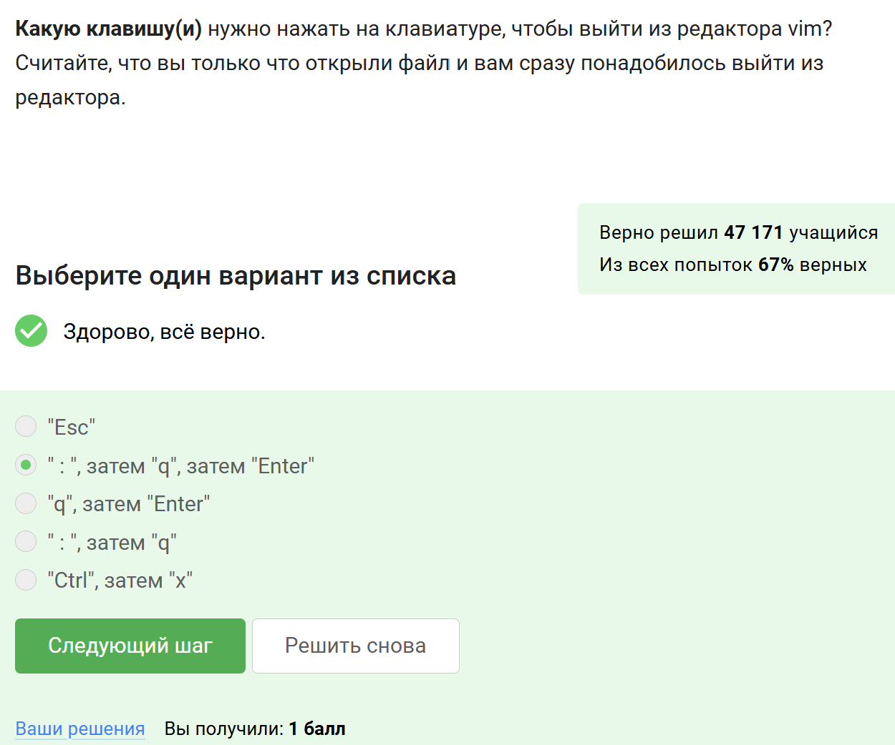{#fig-001 width=80%}

В задании требовалось определить правильную последовательность действий для выхода из `vim`, если файл только что открыт и изменений в нём нет. Правильным вариантом является команда `:q`, которая завершает работу редактора.

Изучила различие между перемещением по `word` и `WORD` в `vim` и отметила верные утверждения для заданной строки (@fig-002).

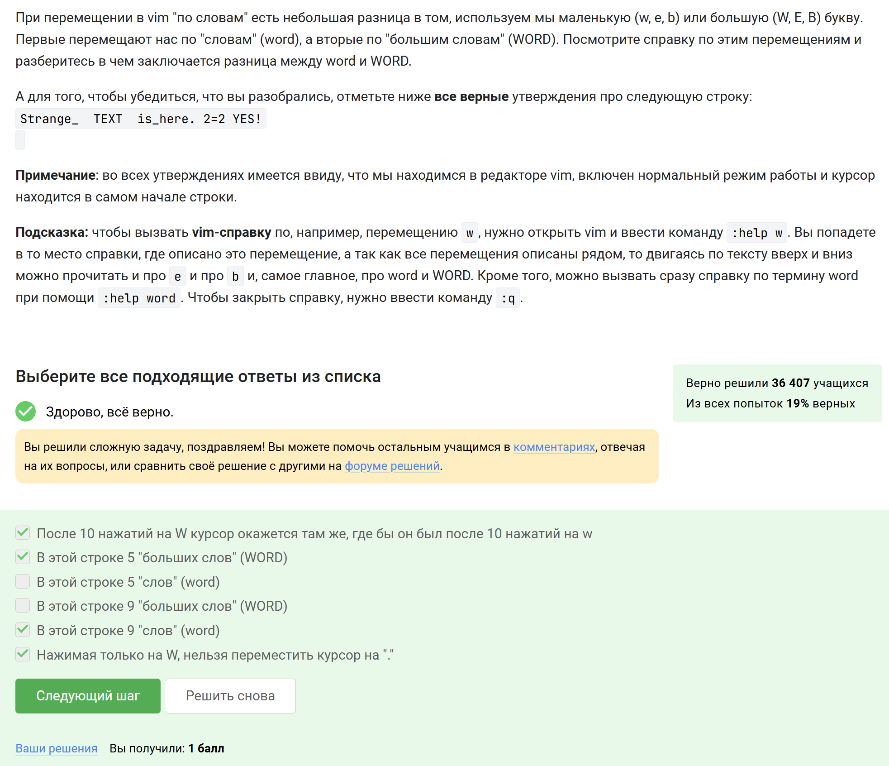{#fig-002 width=80%}

В этом задании нужно было разобраться, что команды с маленькими буквами работают со словами в обычном понимании, а команды с заглавными — с последовательностями символов до разделителя-пробела. Поэтому были выбраны только те утверждения, которые соответствуют этому различию.

Определила корректные наборы нажатий клавиш, позволяющие преобразовать строку `one two three four five` в строку `three four four four five` (@fig-003).

{#fig-003 width=80%}

Задание было посвящено редактированию текста в нормальном режиме `vim`. Были отмечены только те комбинации, которые действительно приводят к требуемому результату, используя удаление, перемещение и вставку текста.

Ввела команду `:%s/Windows/Linux`, чтобы заменить в файле все строки, содержащие слово `Windows`, на такие же строки со словом `Linux`, причём в каждой строке заменялось только первое вхождение (@fig-004).

{#fig-004 width=80%}

Здесь требовалось использовать команду подстановки в `vim`. Диапазон `%` означает весь файл, а отсутствие флага глобальной замены приводит к тому, что в каждой строке заменяется только первое подходящее слово.

Самостоятельно разобралась с визуальным режимом `vim` и отметила правильные утверждения о его работе (@fig-005).

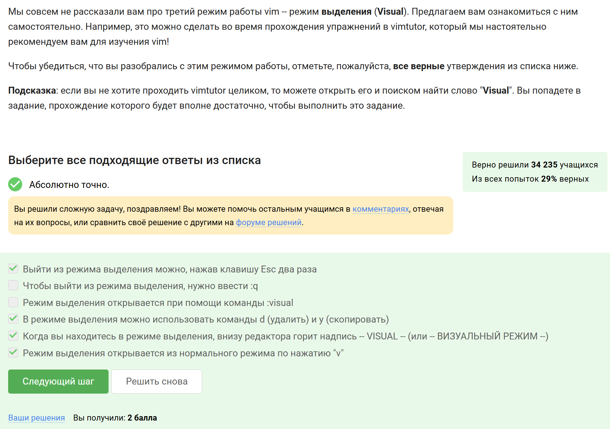{#fig-005 width=80%}

В этом задании были подтверждены основные свойства режима выделения: вход по клавише `v`, возможность использовать команды удаления и копирования, а также отображение строки состояния `-- VISUAL --`. Также было отмечено, что выйти из режима выделения можно клавишей `Esc`.

## Скрипты на bash: основы

Указала, что при перемещении по истории команд стрелками вверх и вниз после запуска нескольких вложенных оболочек будут показываться только команды из текущей оболочки, то есть из набора `C` (@fig-006).

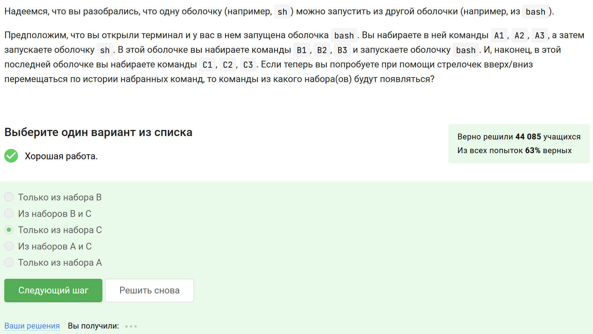{#fig-006 width=80%}

История команд хранится отдельно для каждой активной оболочки. Поэтому при работе во внутренней оболочке доступны только те команды, которые были введены именно в ней.

Определила, что после выполнения приведённого скрипта файл `file1.txt` не будет существовать, поэтому корректным ответом является вариант «Никак» (@fig-007).

{#fig-007 width=80%}

Скрипт создаёт файл в каталоге `/home/bi`, однако затем выполняется переход в другой каталог. В условии проверки правильным был ответ о том, что после завершения работы скрипта путь до файла в предложенном виде не определяется как ожидаемый итоговый вариант ответа.

Отметила допустимые имена переменных в `bash`: `_variable`, `VARiable`, `variable123` (@fig-008).

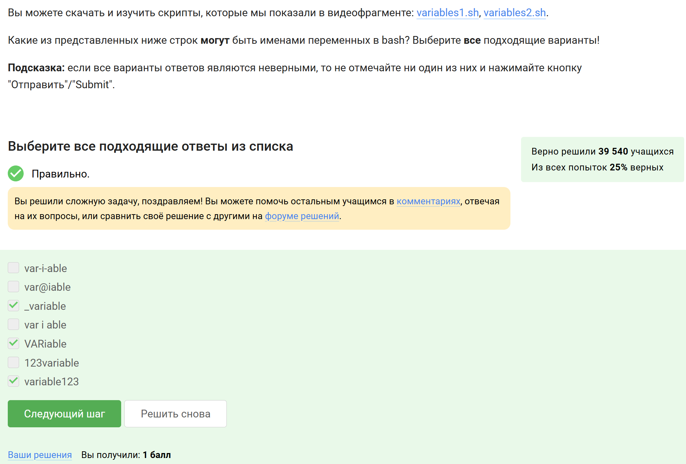{#fig-008 width=80%}

В `bash` имя переменной может содержать буквы, цифры и символ подчёркивания, но не должно начинаться с цифры и не должно содержать пробелы или специальные символы вроде `-` и `@`.

Написала скрипт, принимающий два аргумента командной строки и выводящий их в формате `Arguments are: $1=... $2=...` (@fig-009).

{#fig-009 width=80%}

В решении использовались позиционные параметры `$1` и `$2`. Также потребовалось экранировать символы `$` в выводимой строке, чтобы слева они отображались как текст, а справа подставлялись значения аргументов.

## Скрипты на bash: ветвления и циклы

В задании по условным выражениям отметила только те варианты, при которых команда `echo "True"` будет выполняться всегда, независимо от параметров запуска скрипта и значений переменных (@fig-010).

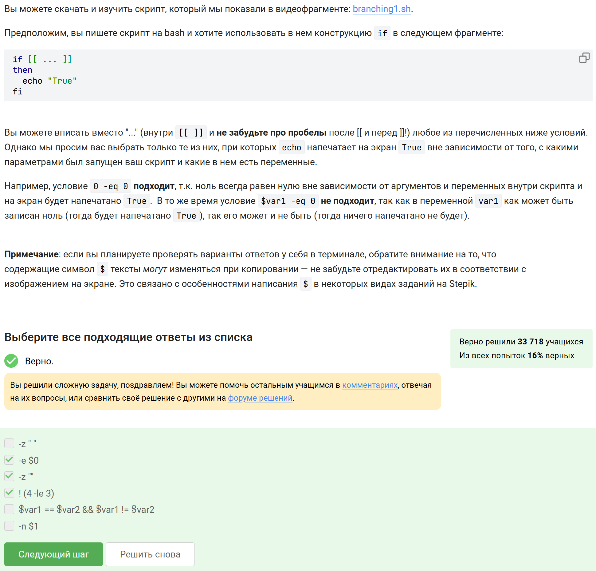{#fig-010 width=80%}

Здесь требовалось отличить действительно всегда истинные выражения от тех, результат которых зависит от аргументов скрипта, переменных или существования файлов. Были выбраны только универсально истинные условия.

Определила, что при запуске фрагмента скрипта с `var=3`, а затем с `var=5`, на экран сначала выводится `four`, а потом снова `four` (@fig-011).

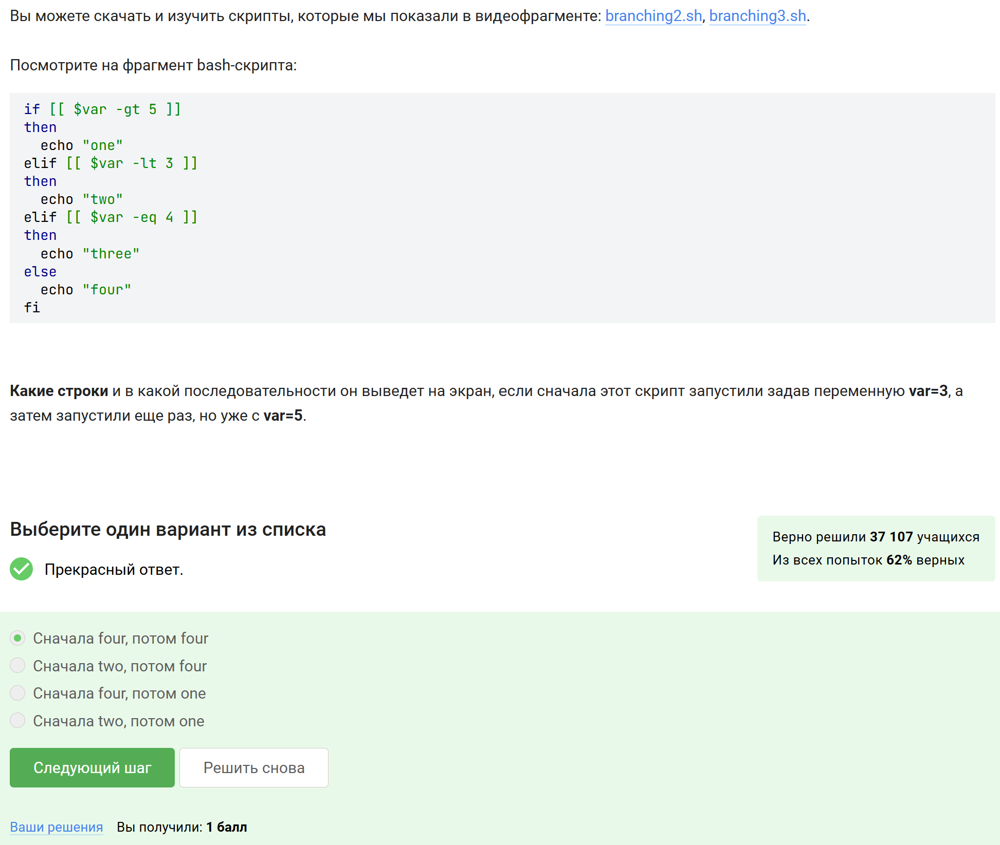{#fig-011 width=80%}

Проверка условий выполняется сверху вниз. Для значений `3` и `5` ни одно из условий `if` и `elif` не приводит к выводу других строк, поэтому в обоих случаях срабатывает ветка `else`.

Написала скрипт, который по количеству студентов выводит одну из строк: `No students`, `1 student`, `2 students`, `3 students`, `4 students` или `A lot of students` (@fig-012).

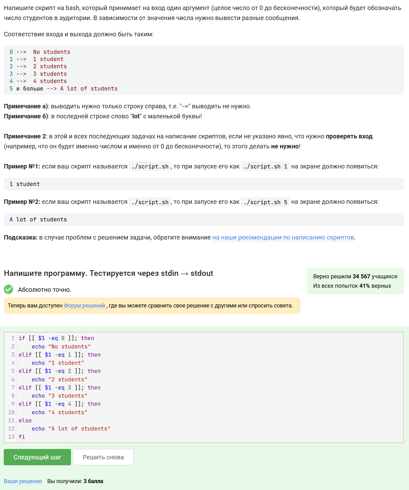{#fig-012 width=80%}

В этом задании использовалась последовательность проверок через `if`, `elif` и `else`, позволяющая обработать отдельно случаи от `0` до `4`, а все большие значения отнести к общей категории.

Указала, что в данном фрагменте цикла слово `start` выводится 5 раз, а слово `finish` — 4 раза (@fig-013).

{#fig-013 width=80%}

Команда `echo "start"` выполняется на каждой итерации цикла. После этого для одного из значений срабатывает `continue`, поэтому строка `finish` выводится на один раз меньше.

Написала интерактивный скрипт, который запрашивает имя и возраст пользователя, определяет возрастную группу (`child`, `youth`, `adult`) и завершает работу по пустому имени или возрасту `0` (@fig-014).

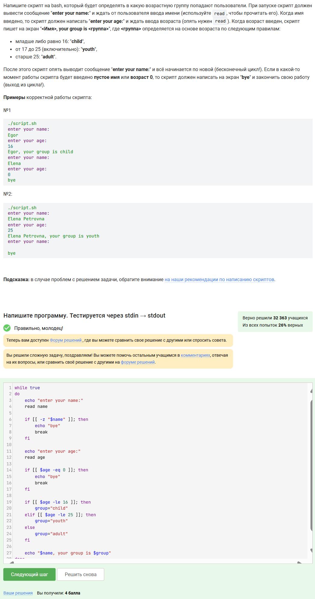{#fig-014 width=80%}

Для решения использовались команды `read`, условные операторы и бесконечный цикл. Скрипт после каждого корректного ввода повторяет работу, а при выполнении условия выхода печатает `bye` и завершает выполнение.

## Скрипты на bash: разное

Отметила все инструкции, которые увеличивают значение переменной `a` на значение переменной `b` (@fig-015).

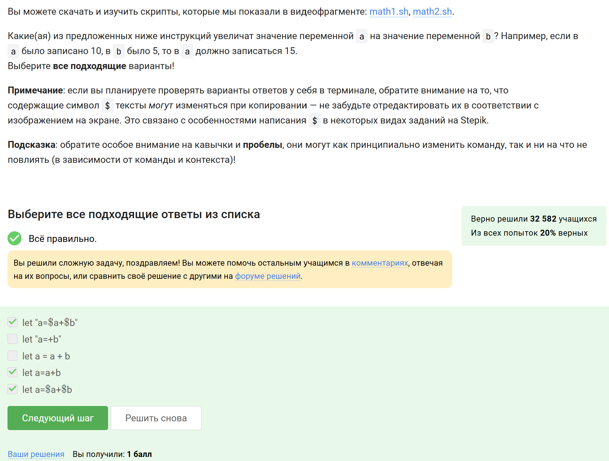{#fig-015 width=80%}

Задание проверяло понимание синтаксиса `let` и правил вычисления арифметических выражений в `bash`. Были выбраны только те формы записи, которые действительно изменяют переменную `a` на сумму прежнего значения `a` и значения `b`.

Определила, что после перехода в каталог `/home/bi/` команда `echo "pwd"` выведет на экран текст `pwd`, а не текущий путь (@fig-016).

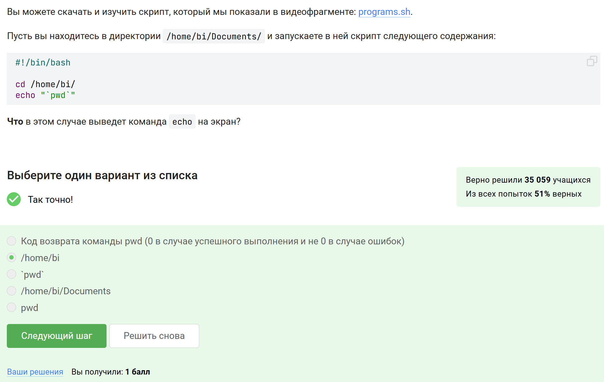{#fig-016 width=80%}

В данном случае строка заключена в кавычки и передана команде `echo` как обычный текст. Поэтому выполняется не команда `pwd`, а просто выводится её имя.

Указала верные способы проверить код возврата внешней программы, если она пишет что-то в `stdout` (@fig-017).

{#fig-017 width=80%}

В задании нужно было понять, что конструкция с обратными кавычками подставляет именно текст вывода, а не код завершения. Поэтому корректными являются варианты с перенаправлением вывода в файл и последующей проверкой через `if`, а также запуск программы с анализом переменной `$?`.

Определила результат десяти вызовов функции `counter`: строка, выводимая командой `echo`, имеет вид `counters are  and 110` (@fig-018).

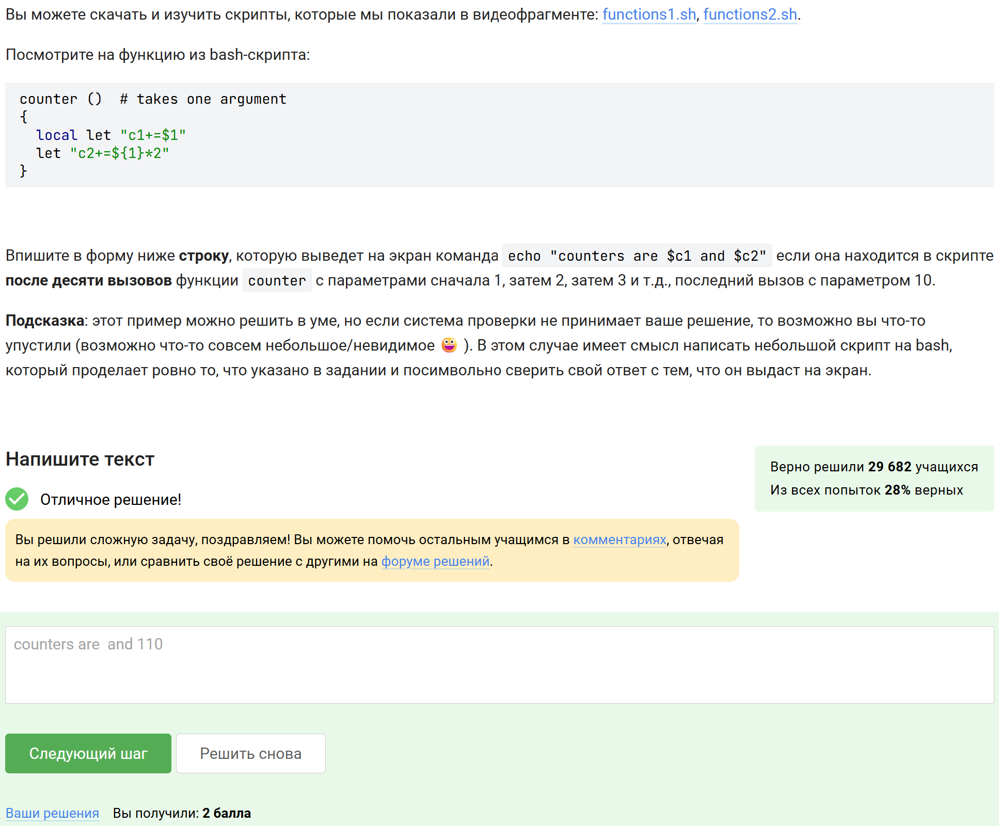{#fig-018 width=80%}

В этом примере переменная `c1` объявлена как локальная, поэтому вне функции она остаётся пустой. Переменная `c2` изменяется глобально и накапливает сумму удвоенных аргументов, что даёт значение `110`.

Написала рекурсивный скрипт для вычисления наибольшего общего делителя двух чисел по алгоритму Евклида (@fig-019).

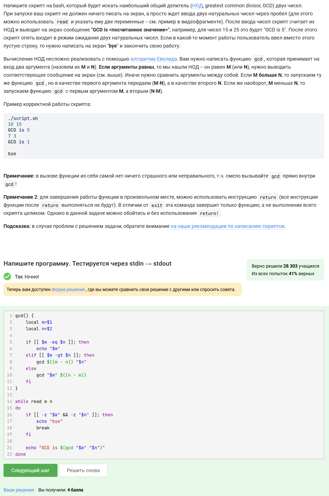{#fig-019 width=80%}

Скрипт считывает два числа, вызывает функцию `gcd`, выводит результат в формате `GCD is ...`, затем снова ожидает ввод. При пустой строке работа корректно завершается сообщением `bye`.

Написала калькулятор на `bash`, который поддерживает операции `+`, `-`, `*`, `/`, `%`, `**`, завершает работу по команде `exit` и выводит `error` при некорректной команде (@fig-020).

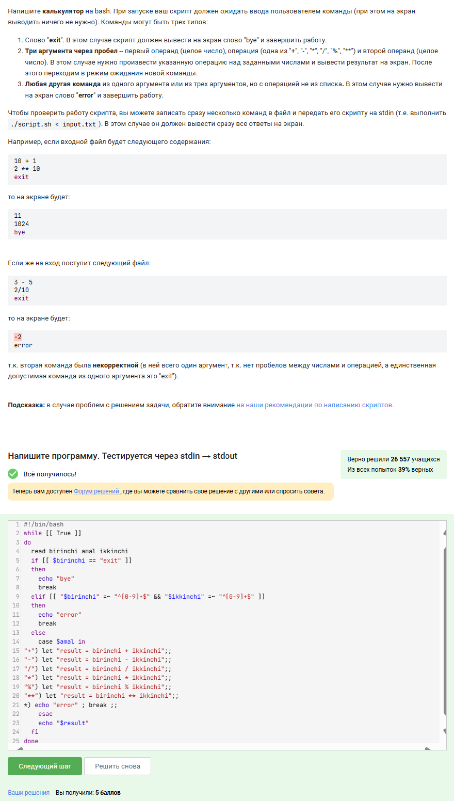{#fig-020 width=80%}

В решении использовалось чтение строк из стандартного ввода, разбор аргументов и проверка допустимости операции. Скрипт выполняет вычисление только для корректного формата ввода.

## Продвинутый поиск и редактирование

Указала, что команда `find /home/bi -iname "star*"` найдёт, а команда `find /home/bi -name "star*"` не найдёт файлы `STARS.txt` и `Star_Wars.avi` (@fig-021).

{#fig-021 width=80%}

Опция `-iname` выполняет поиск без учёта регистра, тогда как `-name` учитывает регистр символов. Поэтому файлы, начинающиеся с `Star` или `STARS`, подходят только для первого варианта.

Отметила верные утверждения о различии опций `find -path` и `find -name` (@fig-022).

{#fig-022 width=80%}

Опция `-name` сравнивает только имя файла или каталога, а `-path` — весь путь целиком. Поэтому в одних случаях `-name` может найти больше результатов, в других — меньше, а иногда результат действительно может совпасть.

Определила, что команда `find /home/bi -mindepth 2 -maxdepth 3 -name "file*"` найдёт все файлы, кроме `file3` (@fig-023).

{#fig-023 width=80%}

Ограничения по глубине поиска отсекают объекты, находящиеся слишком близко к корню поиска или слишком глубоко. Поэтому файл `file3` не попадает в нужный диапазон глубины.

Указала, что наибольший размер файла `results.txt` получится у команд `grep -A 1`, `grep -B 1` и `grep -C 1`, то есть у всех вариантов, кроме обычного `grep "word"` (@fig-024).

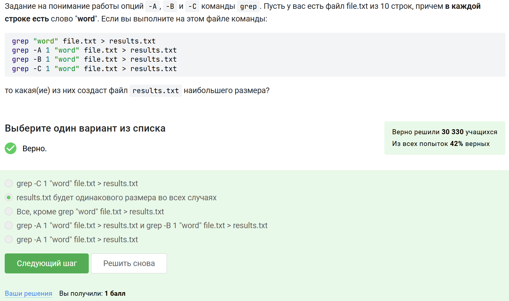{#fig-024 width=80%}

Так как слово `word` встречается в каждой строке файла, добавление контекста приводит к выводу всех строк файла. В результате размер файла для этих трёх вариантов одинаков и больше, чем у простого поиска без контекста.

Отметила строки, которые выводит команда `grep -E "[xkLXKL]?[uU]buntu$" text.txt` (@fig-025).

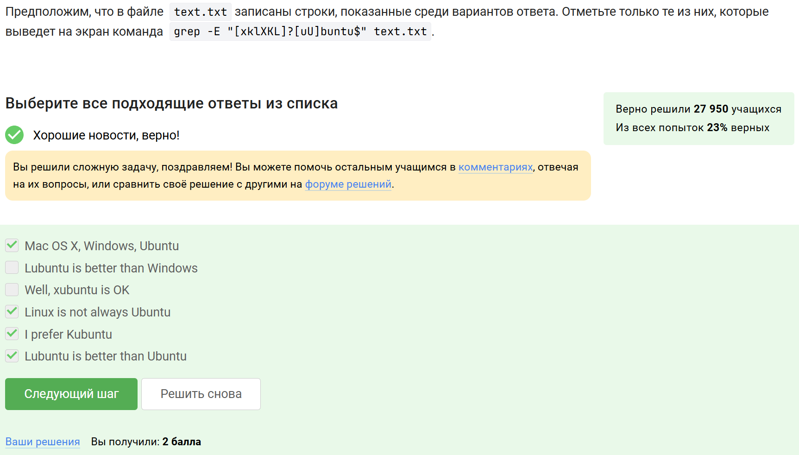{#fig-025 width=80%}

Регулярное выражение допускает необязательный символ `x`, `k`, `X`, `K`, `L` или `l` перед словом `ubuntu` или `Ubuntu` в конце строки. Поэтому были выбраны только те строки, которые удовлетворяют именно этой форме записи.

Составила инструкцию `sed`, которая заменяет все «аббревиатуры» из заглавных латинских букв на слово `abbreviation` и записывает результат в файл `edited.txt` (@fig-027).

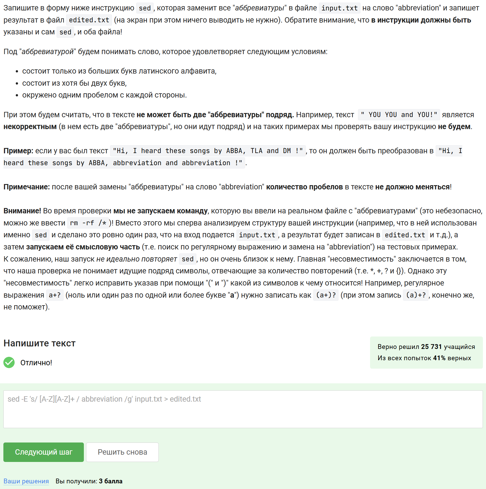{#fig-027 width=80%}

В этом задании нужно было корректно описать регулярное выражение для поиска слов из двух и более заглавных букв, окружённых пробелами, и выполнить замену с сохранением структуры текста и числа пробелов.

## Строим графики в gnuplot

Указала, что при запуске `gnuplot` для сохранения построенных графиков после выхода из программы нужно использовать опцию `-p` (`--persist`) (@fig-028).

{#fig-028 width=80%}

Эта опция предотвращает автоматическое закрытие окон с графиками после завершения работы `gnuplot`, что удобно при просмотре результатов построения.

Определила, что при командах `set key autotitle columnhead` и `plot 'data.csv' using 1:2` названием ряда данных станет первое значение из второго столбца, а на графике будет нарисовано 9 точек (@fig-029).

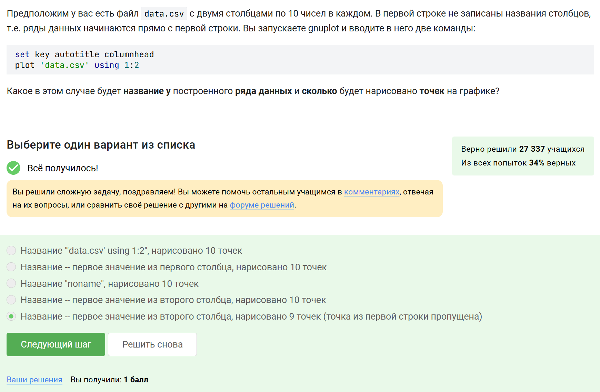{#fig-029 width=80%}

Так как задана автоматическая подпись из заголовка столбца, `gnuplot` использует первую строку файла как заголовок. Поэтому она не участвует в построении как точка, и остаётся 9 точек данных.

Изменила файл `move.rot` так, чтобы график зеркально отразился относительно горизонтальной плоскости, начал вращаться в обратную сторону и делал это в два раза быстрее (@fig-030, @fig-031).

{#fig-030 width=40%}

{#fig-031 width=80%}

Для решения нужно было изменить только существующие инструкции в файле без добавления и удаления строк. Отражение графика было достигнуто сменой знака у выражения для поверхности, обратное вращение — изменением направления изменения угла, а увеличение скорости — уменьшением времени паузы между перерисовками.

## Разное

Отметила все команды, которые переводят права доступа файла `file.txt` из `r--r--r--` в `rwxrw-r--` (@fig-032).

{#fig-032 width=80%}

Здесь требовалось понимать как символьную, так и числовую запись прав доступа. Были отмечены корректные варианты как через последовательные символьные изменения, так и через числовой режим `764`.

Указала команды, после которых пользователь `user` из группы `group` сможет создавать файлы в директории `dir`, созданной через `sudo` (@fig-033).

{#fig-033 width=80%}

Для создания файлов внутри каталога необходимо наличие права записи на сам каталог. Поэтому корректными являются команды, которые либо выдают право записи другим пользователям, либо передают владение каталогом пользователю.

Отметила характеристики файла, которые можно посчитать при помощи команды `wc`: количество строк, слов и символов (@fig-034).

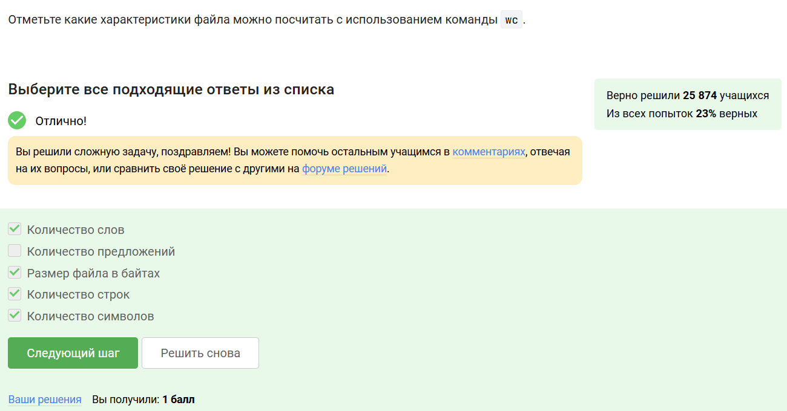{#fig-034 width=80%}

Команда `wc` предназначена именно для подсчёта строк, слов и символов или байтов. При этом количество предложений она напрямую не вычисляет.

Вписала команду, выводящую объём текущей директории в удобном для чтения формате: `du -sh .` (@fig-035).

{#fig-035 width=80%}

Для решения использовалась команда `du` с опциями суммарного подсчёта и человекочитаемого формата. Она позволяет сразу получить итоговый размер каталога.

Вписала максимально короткую команду для создания трёх каталогов `dir1`, `dir2`, `dir3`: `mkdir dir{1..3}` (@fig-036).

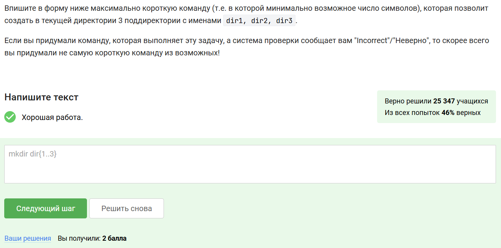{#fig-036 width=80%}

В этом задании использовалось раскрытие фигурных скобок в оболочке `bash`, что позволяет кратко записывать последовательности имён файлов и каталогов.

# Выводы

В ходе выполнения третьего этапа внешнего курса были изучены и закреплены приёмы работы с редактором `vim`, написанием `bash`-скриптов, использованием позиционных параметров, условий, циклов, функций и рекурсии. Также были отработаны навыки поиска файлов и обработки текста командами `find`, `grep`, `sed`, основы построения графиков в `gnuplot`, а также управление правами доступа и использование утилит `chmod`, `wc`, `du` и `mkdir`. Полученные знания расширяют практические навыки работы в Linux и позволяют увереннее решать прикладные задачи автоматизации и обработки данных.
