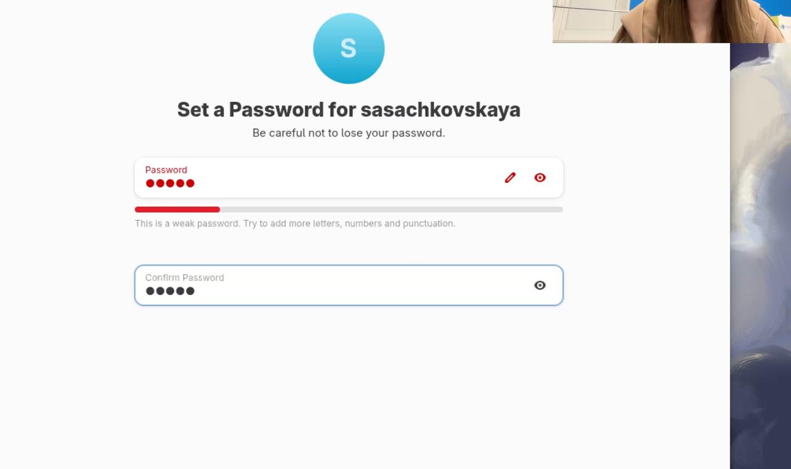
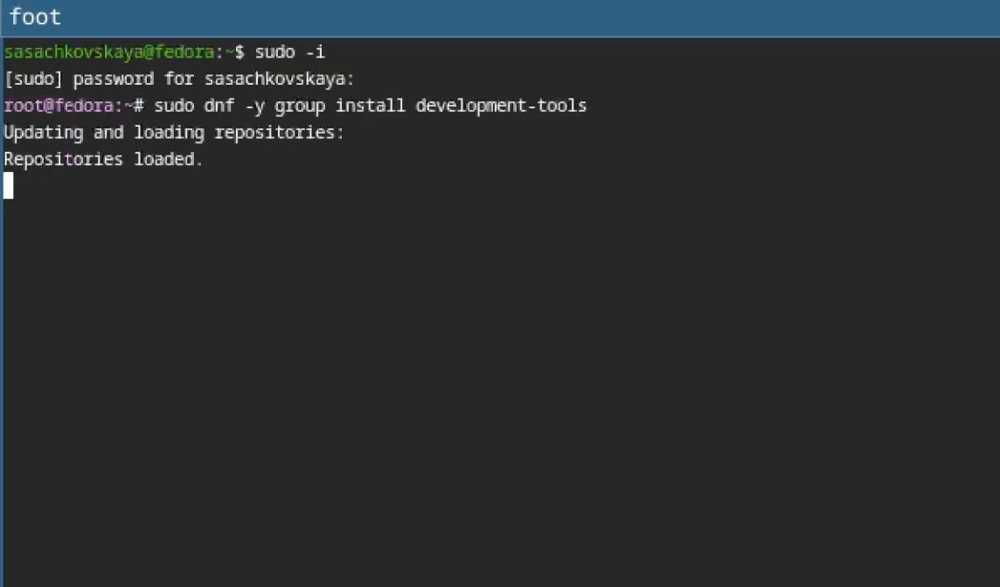
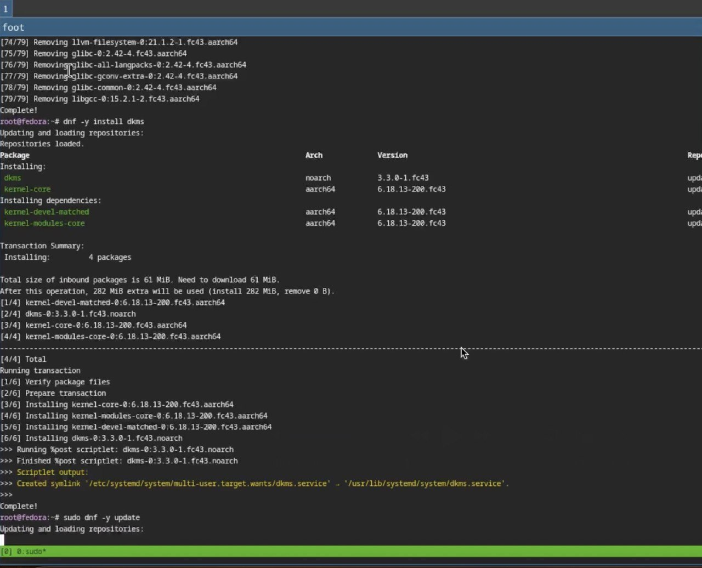
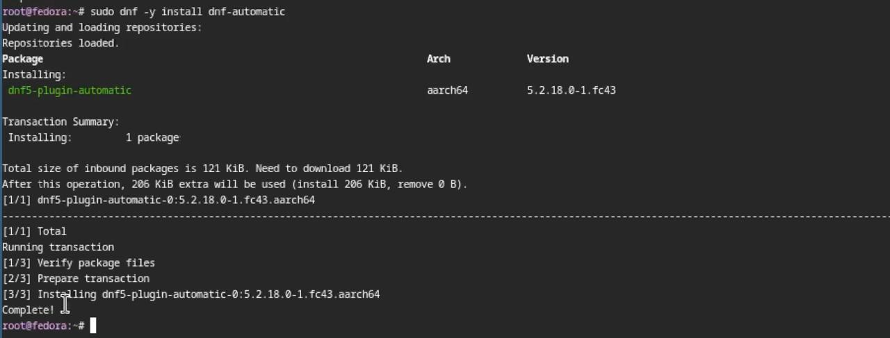
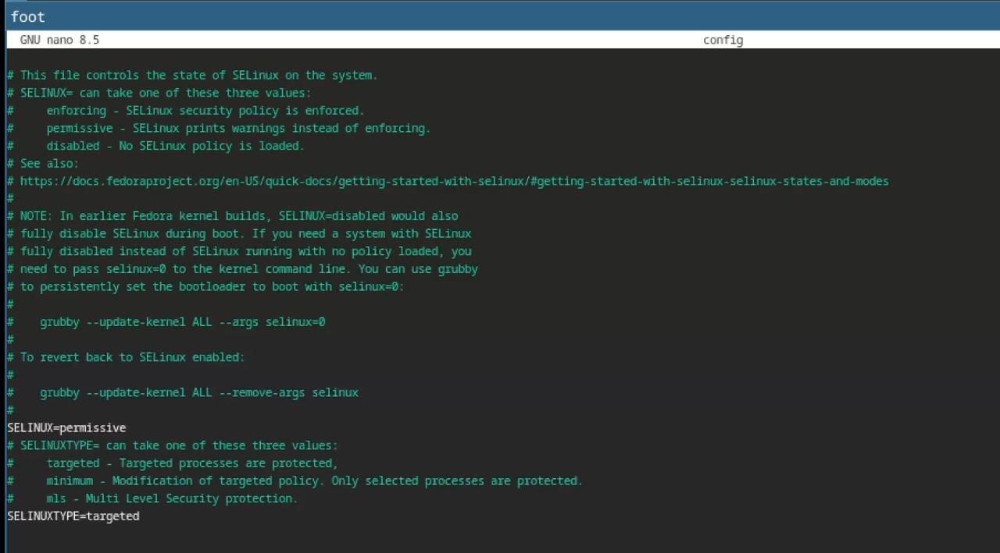
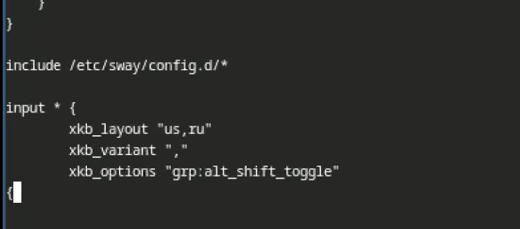
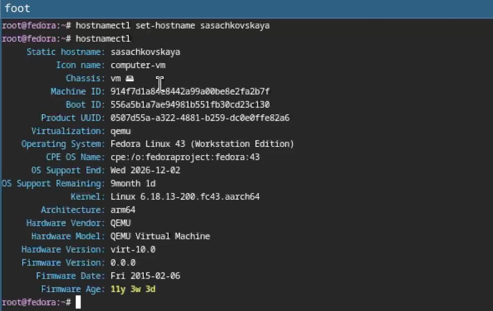
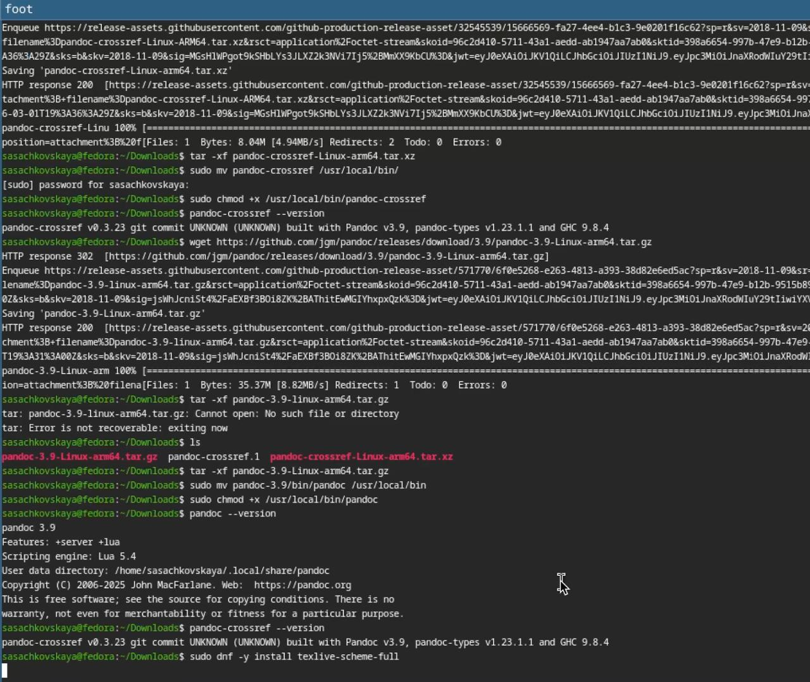
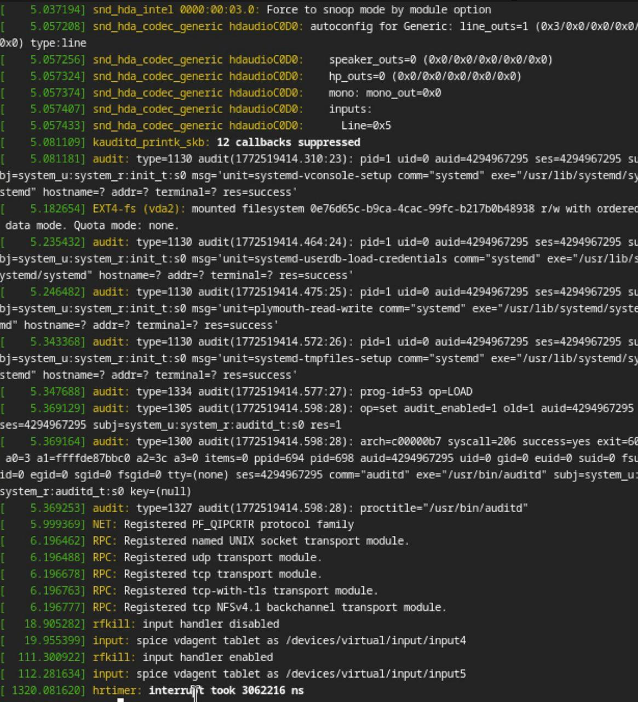

---
## Author
author:
  name: Сачковская София Александровна
  degrees: 
  email: 1132259310@rudn.ru
  affiliation:
    - name: Российский университет дружбы народов
      country: Российская Федерация
      postal-code: 117198
      city: Москва
      address: ул. Миклухо-Маклая, д. 6
## Title
title: Лабораторная работа №1
subtitle: Установка ОС Linux
license: CC BY
date: today
date-format: "YYYY-MM-DD" # Example: 2025-09-06
lang: ru
format:
  beamer:
    pdf-engine: xelatex
    theme: Madrid
    colortheme: dolphin
    aspectratio: 169
  revealjs:
    theme: simple
    slide-number: true
mainfont: "Liberation Serif"
sansfont: "Liberation Sans"
monofont: "Liberation Mono"
---

# Информация

## Докладчик

:::::::::::::: {.columns align=center}
::: {.column width="70%"}

  * Сачковская София Александровна
  * студент НКАбд-06-25
  * Российский университет дружбы народов им. П. Лумумбы
  * [1132259310@rudn.ru]
  * <https://github.com/sachkovskayasofia>

:::
::: {.column width="30%"}

:::
::::::::::::::

# Вводная часть

## Актуальность

В связи с необходимостью выполнения индивидуальных проектов и лабораторных работ в ходе обучения в Высшем Учебном Заведении студентам неоднократно потребуется прибегать к установке ОС на виртуальную машину(в частности ОС Linux)

## Объект и предмет исследования

- Установка ОС на Виртуальную машину

## Цели и задачи

Установка ОС на виртуальную машину

## Практическая значимость

В ходе выполнения лабораторной работы студент научится устанавливать ОС Linux Fedora Sway на виртуальную машину

# Задание

- Установка Linux на Qemu
- Установка необходимого ПО
- Первоначальная настройка ОС для дальнейшей работы

# Теоретическое введение

Запуск приложения для установки системы

    Загрузите LiveCD.
    Появится интерфейс начальной конфигурации.
    Нажмите Enter для создания конфигурации по умолчанию.
    Нажмите Enter, чтобы выбрать в качестве модификатора клавишу Win (она же клавиша Super).
    В файле конфигурации эта клавиша будет обозначена как $Mod.
    Нажмите комбинацию Win+Enter для запуска терминала.
    В терминале запустите liveinst.
    Для перехода к раскладке окон с табами нажмите Win+w.

Установка системы на диск

    Выберите язык интерфейса и перейдите к настройкам установки операционной системы.
    При необходимости скорректируйте часовой пояс, раскладку клавиатуры (рекомендуется в качестве языка по умолчанию указать английский язык).
    Место установки ОС оставьте без изменения.
    Установите имя и пароль для пользователя root.
    Установите имя и пароль для Вашего пользователя.
    Задайте сетевое имя Вашего компьютера.
    После завершения установки операционной системы корректно перезапустите виртуальную машину.
    В VirtualBox оптический диск должен отключиться автоматически, но если это не произошло, то необходимо отключить носитель информации с образом.

# Выполнение лабораторной работы

Регистрирую нового пользователя в ОС(рис. -@fig:001)

{#fig:001 width=70%}

Установил SWAY и приступаю к выполнению лабораторной работы (рис. -@fig:002)

{#fig:002 width=70%}

---

 
Устанавливаю средства разработки (рис. -@fig:003)

{#fig:003 width=70%}

---

Обновляю пакеты. (рис. -@fig:004)

{#fig:004 width=70%}

---

Запускаю скрипт для автоматического обновления пакетов через пакетный менеджер dnf. (рис. -@fig:005)

{#fig:005 width=70%}

---

Отключаю защиту SELinux, так как на данном курсе мы не будем рассматривать работу с ней. (рис. -@fig:006)

{#fig:006 width=70%}

---

Настраиваю xkb, добавляю вторую раскладку клавиатуры с русским языком и задаю переключение на right ctrl. (рис. -@fig:007)

{#fig:007 width=70%}

---

Проверяю корректность заданного имени для hostname. (рис. -@fig:008)

{#fig:008 width=70%}

---

Устанавливаю pandoc, pandoc-crossref, texlive для работы над отчетами для лабораторных работ. (рис. -@fig:009)

{#fig:009 width=70%}

---

# Домашнее задание

Проверяю последовательность загрузки графического окружения командой dmesg | grep -i с указанием вывода желаемого нахождения (рис. -@fig:010)

{#fig:010 width=70%}

---

#Ответы на контрольные вопросы:

1. Какую информацию содержит учётная запись пользователя?

Учётная запись пользователя содержит: имя пользователя (логин), UID (уникальный идентификатор пользователя), GID (идентификатор основной группы), домашний каталог, используемую командную оболочку, а также информацию о пароле (хранится в зашифрованном виде).

Основные данные хранятся в файлах /etc/passwd, /etc/shadow и /etc/group.

2. Укажите команды терминала и приведите примеры
Для получения справки по команде

man, --help, info

Пример: man ls

Для перемещения по файловой системе

cd, pwd

Пример: cd /home

Для просмотра содержимого каталога

ls

Пример: ls -l

Для определения объёма каталога

du

Пример: du -sh Documents

Для создания / удаления каталогов / файлов

mkdir, touch, rm, rmdir

Пример: mkdir testdir
rm file.txt

Для задания определённых прав на файл / каталог

chmod, chown

Пример: chmod 755 file.txt

Для просмотра истории команд

history

Пример: history

---

3. Что такое файловая система? Приведите примеры с краткой характеристикой.

Файловая система — это способ организации и хранения данных на носителе информации, определяющий структуру каталогов, размещение файлов и правила доступа к ним.

Примеры:

ext4 — основная файловая система Linux, поддерживает журналирование и отличается надёжностью.

NTFS — используется в Windows, поддерживает права доступа и большие объёмы данных.

FAT32 — простая файловая система, часто используется на флеш-накопителях, имеет ограничение на размер файла.

XFS — высокопроизводительная файловая система для работы с большими объёмами данных.

---

4. Как посмотреть, какие файловые системы подмонтированы в ОС?

Используются команды mount, df -T или просмотр файла /proc/mounts.

---

5. Как удалить зависший процесс?

Сначала определяется идентификатор процесса с помощью команд ps или top, затем процесс завершается командой kill. В случае необходимости используется принудительное завершение с параметром -9.

---

# Выводы

Я приобрела практические навыки установки операционной системы на виртуальную машину, настроила минимально необходимые для дальнейшей работы сервисы

---

# Список литературы{.unnumbered}

::: {#refs}
:::
