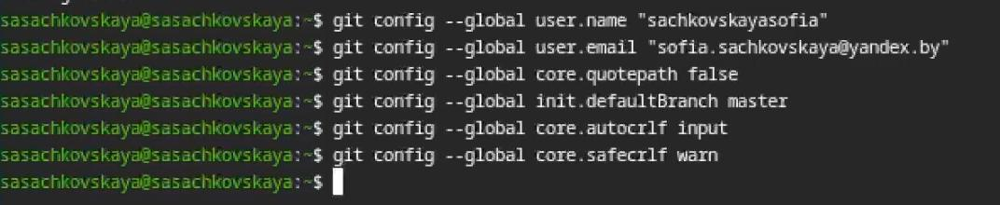
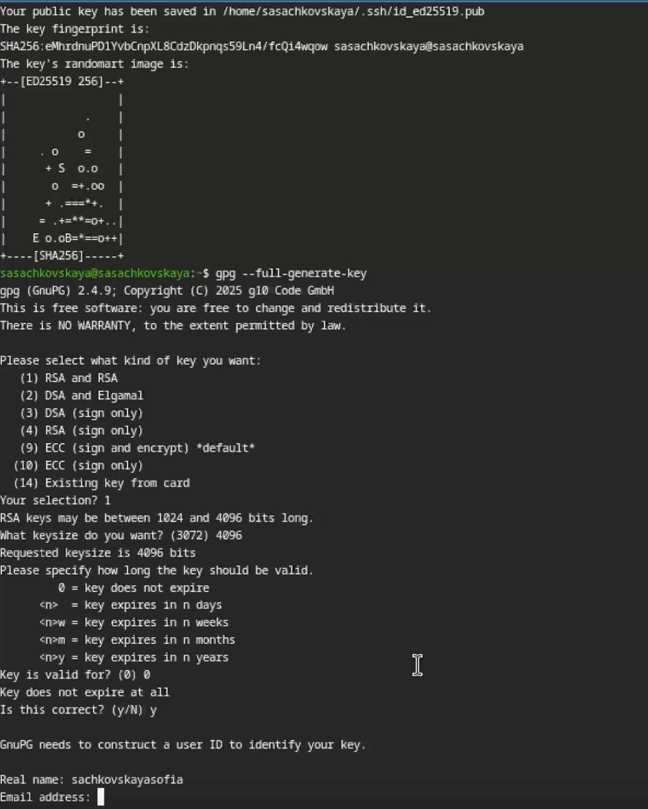
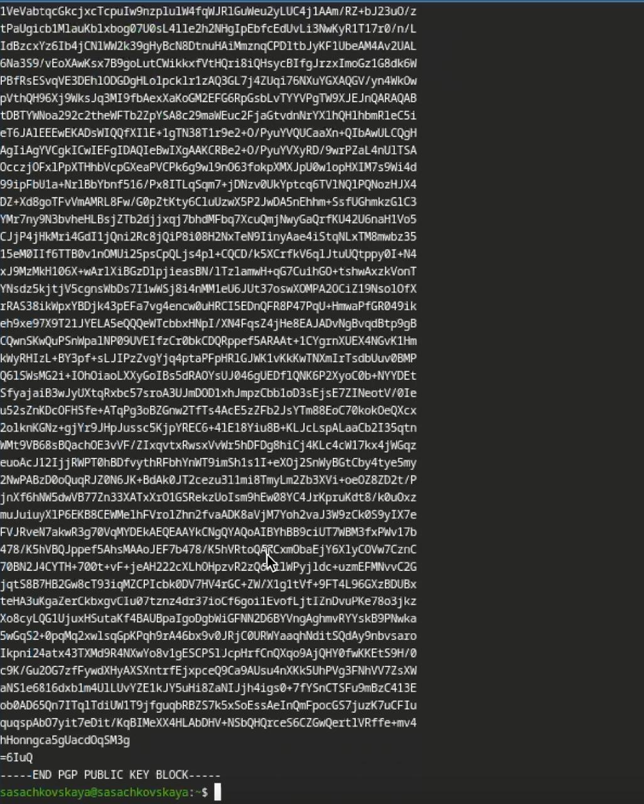
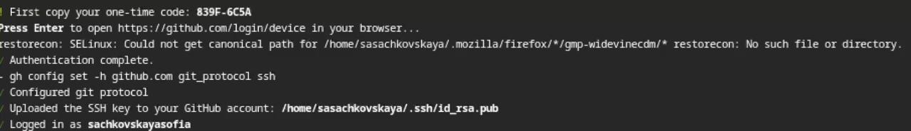
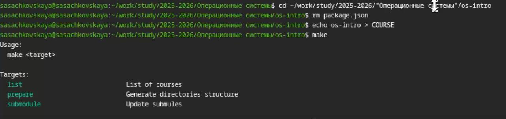

---
## Author
author:
  name: Сачковская София Александровна
  email: 1132259310@rudn.ru
  affiliation:
    - name: Российский университет дружбы народов
      country: Российская Федерация
      postal-code: 117198
      city: Москва
      address: ул. Миклухо-Маклая, д. 6
## Title
title: Лабораторная работа 2
subtitle: Первоначальная настройка git
license: CC BY
date: today
date-format: "YYYY-MM-DD" # Example: 2025-09-06
lang: ru
format:
  beamer:
    pdf-engine: xelatex
    theme: Madrid
    colortheme: dolphin
    aspectratio: 169
  revealjs:
    theme: simple
    slide-number: true
mainfont: "Liberation Serif"
sansfont: "Liberation Sans"
monofont: "Liberation Mono"
---

# Информация

---

## Докладчик

:::::::::::::: {.columns align=center}
::: {.column width="70%"}

  * Сачковская София Александровна
  * студент НКАбд-06-25
  * Российский университет дружбы народов им. П. Лумумбы
  * [1132259310@rudn.ru]
  * <https://github.com/sachkovskayasofia>

:::
::: {.column width="30%"}

---

:::
::::::::::::::

# Вводная часть

## Актуальность

В ходе выполнения лабораторных работ и индивидуального проекта студентам будет необходимо воспользоваться системой контроля версий.

---

## Объект и предмет исследования

Первоначальная настройка git

---

## Цели и задачи

Изучить идеологию и применение средств контроля версий.
Освоить умения по работе с git.

---

# Задание

Создать базовую конфигурацию для работы с git.
Создать ключ SSH.
Создать ключ PGP.
Настроить подписи git.
Зарегистрироваться на Github.
Создать локальный каталог для выполнения заданий по предмету.

---

# Теоретическое введение

Системы контроля версий. Общие понятия

Системы контроля версий (Version Control System, VCS) применяются при работе нескольких человек над одним проектом. Обычно основное дерево проекта хранится в локальном или удалённом репозитории, к которому настроен доступ для участников проекта. При внесении изменений в содержание проекта система контроля версий позволяет их фиксировать, совмещать изменения, произведённые разными участниками проекта, производить откат к любой более ранней версии проекта, если это требуется.

В классических системах контроля версий используется централизованная модель, предполагающая наличие единого репозитория для хранения файлов. Выполнение большинства функций по управлению версиями осуществляется специальным сервером. Участник проекта (пользователь) перед началом работы посредством определённых команд получает нужную ему версию файлов. После внесения изменений, пользователь размещает новую версию в хранилище. При этом предыдущие версии не удаляются из центрального хранилища и к ним можно вернуться в любой момент. Сервер может сохранять не полную версию изменённых файлов, а производить так называемую дельта-компрессию — сохранять только изменения между последовательными версиями, что позволяет уменьшить объём хранимых данных.

Системы контроля версий поддерживают возможность отслеживания и разрешения конфликтов, которые могут возникнуть при работе нескольких человек над одним файлом. Можно объединить (слить) изменения, сделанные разными участниками (автоматически или вручную), вручную выбрать нужную версию, отменить изменения вовсе или заблокировать файлы для изменения. В зависимости от настроек блокировка не позволяет другим пользователям получить рабочую копию или препятствует изменению рабочей копии файла средствами файловой системы ОС, обеспечивая таким образом, привилегированный доступ только одному пользователю, работающему с файлом.

Системы контроля версий также могут обеспечивать дополнительные, более гибкие функциональные возможности. Например, они могут поддерживать работу с несколькими версиями одного файла, сохраняя общую историю изменений до точки ветвления версий и собственные истории изменений каждой ветви. Кроме того, обычно доступна информация о том, кто из участников, когда и какие изменения вносил. Обычно такого рода информация хранится в журнале изменений, доступ к которому можно ограничить.

В отличие от классических, в распределённых системах контроля версий центральный репозиторий не является обязательным.

Среди классических VCS наиболее известны CVS, Subversion, а среди распределённых — Git, Bazaar, Mercurial. Принципы их работы схожи, отличаются они в основном синтаксисом используемых в работе команд.

---

# Выполнение лабораторной работы

Произвожу базовую настройку git. (рис. -@fig:001)

{#fig:001 width=70%}

---

Создаю ssh и gpg ключи. (рис. -@fig:002)

{#fig:002 width=70%}

---

Экспортирую gpg ключ для авторизации на github. (рис. -@fig:003)

{#fig:003 width=70%}

---

Настраиваю автоматические подписи для коммитов. (рис. -@fig:004)

{#fig:004 width=70%}

---

Авторизуюсь на github для работы через терминал. (рис. -@fig:005)

{#fig:005 width=70%}

---

Создаю директорию курса по шаблону (рис. -@fig:006)

{#fig:006 width=70%}

---

Настраиваю рабочую директорию (рис. -@fig:007)

{#fig:007 width=70%}

---

# Выводы

Я изучила идеологию и применение средств контроля версий.
Освоила умения по работе с git.
