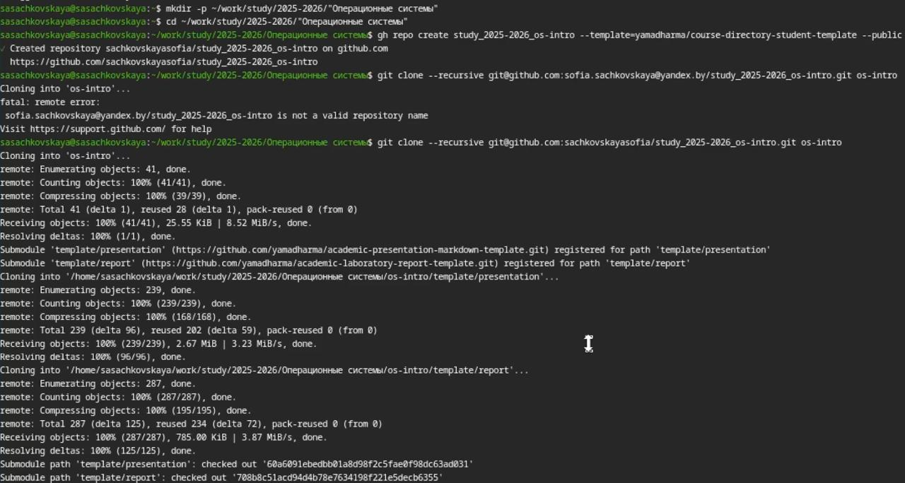

---
## Author
author:
  name: Сачковская София Александровна
  email: 1132259310@rudn.ru
  affiliation:
    - name: Российский университет дружбы народов
      country: Российская Федерация
      postal-code: 117198
      city: Москва
      address: ул. Миклухо-Маклая, д. 6

## Title
title: "Лабораторная работа №2"
subtitle: "Первоначальная настройка git"
license: "CC BY"
---

# Цель работы

Изучить идеологию и применение средств контроля версий.
Освоить умения по работе с git.

# Задание

Создать базовую конфигурацию для работы с git.
Создать ключ SSH.
Создать ключ PGP.
Настроить подписи git.
Зарегистрироваться на Github.
Создать локальный каталог для выполнения заданий по предмету.

# Теоретическое введение

Системы контроля версий. Общие понятия

Системы контроля версий (Version Control System, VCS) применяются при работе нескольких человек над одним проектом. Обычно основное дерево проекта хранится в локальном или удалённом репозитории, к которому настроен доступ для участников проекта. При внесении изменений в содержание проекта система контроля версий позволяет их фиксировать, совмещать изменения, произведённые разными участниками проекта, производить откат к любой более ранней версии проекта, если это требуется.

В классических системах контроля версий используется централизованная модель, предполагающая наличие единого репозитория для хранения файлов. Выполнение большинства функций по управлению версиями осуществляется специальным сервером. Участник проекта (пользователь) перед началом работы посредством определённых команд получает нужную ему версию файлов. После внесения изменений, пользователь размещает новую версию в хранилище. При этом предыдущие версии не удаляются из центрального хранилища и к ним можно вернуться в любой момент. Сервер может сохранять не полную версию изменённых файлов, а производить так называемую дельта-компрессию — сохранять только изменения между последовательными версиями, что позволяет уменьшить объём хранимых данных.

Системы контроля версий поддерживают возможность отслеживания и разрешения конфликтов, которые могут возникнуть при работе нескольких человек над одним файлом. Можно объединить (слить) изменения, сделанные разными участниками (автоматически или вручную), вручную выбрать нужную версию, отменить изменения вовсе или заблокировать файлы для изменения. В зависимости от настроек блокировка не позволяет другим пользователям получить рабочую копию или препятствует изменению рабочей копии файла средствами файловой системы ОС, обеспечивая таким образом, привилегированный доступ только одному пользователю, работающему с файлом.

Системы контроля версий также могут обеспечивать дополнительные, более гибкие функциональные возможности. Например, они могут поддерживать работу с несколькими версиями одного файла, сохраняя общую историю изменений до точки ветвления версий и собственные истории изменений каждой ветви. Кроме того, обычно доступна информация о том, кто из участников, когда и какие изменения вносил. Обычно такого рода информация хранится в журнале изменений, доступ к которому можно ограничить.

В отличие от классических, в распределённых системах контроля версий центральный репозиторий не является обязательным.

Среди классических VCS наиболее известны CVS, Subversion, а среди распределённых — Git, Bazaar, Mercurial. Принципы их работы схожи, отличаются они в основном синтаксисом используемых в работе команд.

# Выполнение лабораторной работы

Произвожу базовую настройку git. (рис. -@fig:001)

{#fig:001 width=70%}

Создаю ssh и gpg ключи. (рис. -@fig:002)

{#fig:002 width=70%}

Экспортирую gpg ключ для авторизации на github. (рис. -@fig:003)

{#fig:003 width=70%}

Настраиваю автоматические подписи для коммитов. (рис. -@fig:004)

{#fig:004 width=70%}

Авторизуюсь на github для работы через терминал. (рис. -@fig:005)

{#fig:005 width=70%}

Создаю директорию курса по шаблону (рис. -@fig:006)

{#fig:006 width=70%}

Настраиваю рабочую директорию (рис. -@fig:007)

{#fig:007 width=70%}
# Выводы

Я изучила идеологию и применение средств контроля версий.
Освоила умения по работе с git.

#Ответы на контрольные вопросы

1. Что такое системы контроля версий (VCS) и для каких задач они предназначены?

Система контроля версий (VCS) — это программное средство, предназначенное для отслеживания изменений в файлах и управления версиями проекта.

Основные задачи VCS: хранение истории изменений, возможность возврата к предыдущим версиям, организация совместной работы нескольких пользователей, фиксация авторства изменений, управление параллельной разработкой и объединение изменений.

2. Объясните понятия: хранилище, commit, история, рабочая копия

Хранилище (репозиторий) — это место, где сохраняется проект и вся история его изменений.

Commit — это зафиксированное изменение проекта. Каждый commit содержит изменённые файлы, информацию об авторе, дату и комментарий.

История — это последовательность всех commit’ов проекта, отражающая процесс его развития.

Рабочая копия — это текущая версия файлов проекта на компьютере пользователя, в которой он вносит изменения.

Рабочая копия изменяется пользователем, затем изменения фиксируются в commit и сохраняются в хранилище, формируя историю проекта.

3. Централизованные и децентрализованные VCS

Централизованные VCS предполагают наличие одного центрального сервера, где хранится репозиторий. Пользователи получают рабочие копии и отправляют изменения обратно на сервер. Без доступа к серверу полноценная работа невозможна. Примерами являются Subversion и CVS.

Децентрализованные VCS предполагают, что каждый пользователь имеет полную копию репозитория вместе с историей изменений. Работа возможна без постоянного подключения к серверу. Примерами являются Git и Mercurial.

Основное различие заключается в способе хранения и распределения репозитория: в централизованных системах он один, в распределённых — у каждого пользователя.

4. Действия при единоличной работе с хранилищем

При индивидуальной работе пользователь создаёт репозиторий, добавляет в него файлы, вносит изменения в рабочей копии и фиксирует их с помощью commit. При необходимости он просматривает историю изменений или возвращается к предыдущей версии проекта. Вся работа выполняется локально.

5. Порядок работы с общим хранилищем

При совместной работе пользователь сначала получает копию общего репозитория. Далее он вносит изменения в рабочую копию и создаёт commit. Перед отправкой изменений он получает актуальные изменения от других участников и при необходимости разрешает конфликты. После этого изменения отправляются в общий репозиторий.

6. Основные задачи, решаемые Git

Git предназначен для распределённого хранения истории изменений, управления версиями проекта, организации параллельной разработки с помощью ветвей, объединения изменений и обеспечения совместной работы разработчиков.

7. Основные команды Git

Команда init используется для создания нового репозитория.
Clone — для копирования удалённого репозитория.
Add — для добавления файлов под контроль версий.
Commit — для фиксации изменений.
Status — для просмотра текущего состояния файлов.
Log — для просмотра истории изменений.
Diff — для просмотра различий между версиями.
Branch — для создания и управления ветвями.
Checkout — для переключения между версиями и ветвями.
Merge — для объединения ветвей.
Pull — для получения изменений из удалённого репозитория.
Push — для отправки изменений в удалённый репозиторий.

8. Примеры использования при работе с локальным и удалённым репозиториями

При работе с локальным репозиторием пользователь создаёт проект, вносит изменения и фиксирует их commit’ами, просматривает историю и управляет версиями.

При работе с удалённым репозиторием пользователь копирует проект на свой компьютер, создаёт изменения, фиксирует их и отправляет на сервер. Также он регулярно получает обновления от других участников проекта.

9. Что такое ветви и зачем они нужны?

Ветвь — это отдельная линия разработки внутри репозитория. Ветви позволяют разрабатывать новые функции, исправлять ошибки и проводить эксперименты независимо от основной версии проекта. Это обеспечивает параллельную и безопасную разработку.

10. Как и зачем игнорировать файлы при commit?

Игнорирование файлов осуществляется с помощью специального файла .gitignore, в котором указываются файлы и каталоги, не подлежащие включению в репозиторий.

Это необходимо для исключения временных файлов, служебных данных, файлов сборки и персональных настроек. Игнорирование уменьшает размер репозитория и делает совместную работу более удобной.

# Список литературы{.unnumbered}

::: {#refs}
:::
