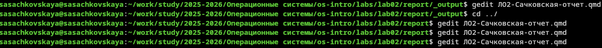
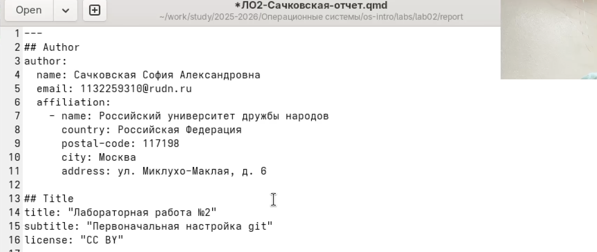
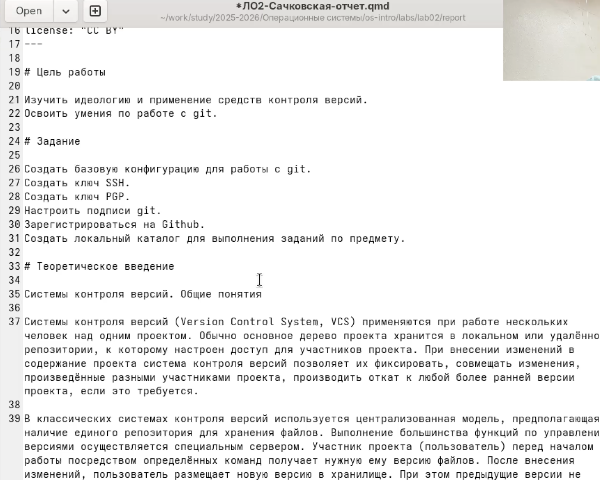
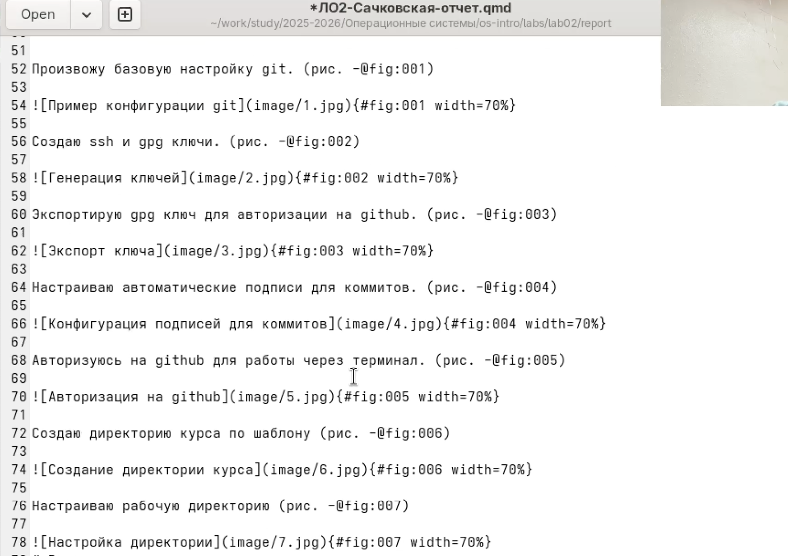

---
## Author
author:
  name: Сачковская София Александровна
  email: 1132259310@rudn.ru
  affiliation:
    - name: Российский университет дружбы народов
      country: Российская Федерация
      postal-code: 117198
      city: Москва
      address: ул. Миклухо-Маклая, д. 6
## Title
title: Лабораторная работа №3
subtitle: MarkDown
license: CC BY
date: today
date-format: "YYYY-MM-DD" # Example: 2025-09-06
lang: ru
format:
  beamer:
    pdf-engine: xelatex
    theme: Madrid
    colortheme: dolphin
    aspectratio: 169
  revealjs:
    theme: simple
    slide-number: true
mainfont: "Liberation Serif"
sansfont: "Liberation Sans"
monofont: "Liberation Mono"
---

# Информация

## Докладчик

:::::::::::::: {.columns align=center}
::: {.column width="70%"}

  * Сачковская София Александровна
  * студент НКАбд-06-25
  * Российский университет дружбы народов им. П. Лумумбы
  * [1132259310@rudn.ru]
  * <https://github.com/sachkovskayasofia>

:::
::: {.column width="30%"}

:::
::::::::::::::

# Вводная часть

## Актуальность

В ходе выполнения лабораторных работ студенты будут вынуждены к применению языка разметки MarkDown

## Объект и предмет исследования

Изучение легковесного языка разметки Markdown

## Цели и задачи

Научиться оформлять отчёты с помощью легковесного языка разметки Markdown

---

## Задание

- Сделайте отчёт по предыдущей лабораторной работе в формате Markdown.
- В качестве отчёта просьба предоставить отчёты в 3 форматах: pdf, docx и md (в архиве, поскольку он должен содержать скриншоты, Makefile и т.д.)

---

# Теоретическое введение

– Титульный лист. Первый лист работы оформляется строго по образцу, который обычно
приводится в методических пособиях по вашему предмету. В нем не просто требуется
указать такие элементы, как название образовательного учреждения, вид работы
и сведения об исполнителе, но и расположить их в строгом соответствии со стандарта-
ми.
– Реферат. Реферат фактически является кратким представлением всего вашего отчета
и содержит ряд статистических сведений. В нем нужно указать количество частей,
страниц работы, иллюстраций, приложений, таблиц, использованных литературных
источников и приложений. Здесь же приводится перечень ключевых слов работы
и собственно текст реферата. Последний подразумевает основные элементы работы
от поставленных целей до результатов и рекомендаций по их внедрению. В практике
вузов в отчеты по лабораторным работам реферат обычно не включают.
– Введение. Во введении типовой лабораторной работы обычно прописывают цели
проводимого исследования и задачи, выполнение которых поможет достичь постав-
ленных целей. В то же время существуют работы, в которых студенты становятся
настоящими первооткрывателями. Приходилось ли вам хотя бы однажды испытывать
чувство крайнего любопытства и нетерпения при проведении лабораторной работы?
Ощущать, что буквально через пару минут вы найдете ответ на вопрос, на который
еще никто и никогда не находил ответа? Именно для таких исследований пишется раз-
вернутое введение с доказательством актуальности и новизны изучаемой темы. Чтобы
действительно провести исследование в той области, в которой, как говорится, еще не
ступала нога человека, во введении вам понадобится привести оценку современного
состояния рассматриваемой проблемы и обосновать необходимость ее решения.
– Основная часть. Так как в разных вузах и в разных дисциплинах существуют свои
тонкости проведения лабораторных работ, содержание основной части подробно
описывают в соответствующих методичках. Важно, чтобы в этом разделе работы была
отражена ее суть, описана методика и результаты проделанной работы.
В основной части прописывают следующие элементы:
– цели проводимого исследования;
– задачи, выполнение которых поможет достичь поставленных целей;
– ход работы, в котором описываются выполненные действия;
– прочие разделы, предусмотренные методическими материалами по изучаемой
дисциплине.
– Заключение. В этой части работы вам потребуется сделать выводы по полученным в ходе лабораторной работы результатам. Для этого оцените, насколько полно выполнены поставленные задачи. В сложных работах могут присутствовать и другие элементы,
например, рекомендации для дальнейшего применения результатов проведённой
работы

---

## Выполнение лабораторной работы

В рабочей директории курса открываю через текстовый редактор файл с шаблоном отчета.

{#fig:001 width=70%}

---

Указываю основную информацию о лабораторной работе.

{#fig:002 width=70%}

---

Формирую цель работы, задание и заполняю теоретическое введение.

{#fig:003 width=70%}

---

Описываю процесс выполнения лабораторной работы.

{#fig:004 width=70%}

---

## Выводы

Я научилась оформлять отчеты с помощью легковесного языка разметки MarkDown
