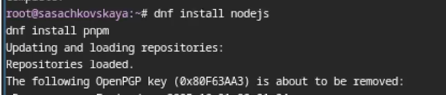
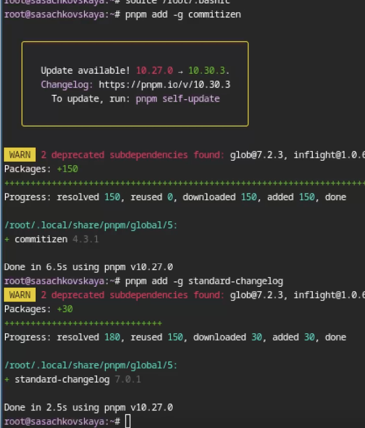
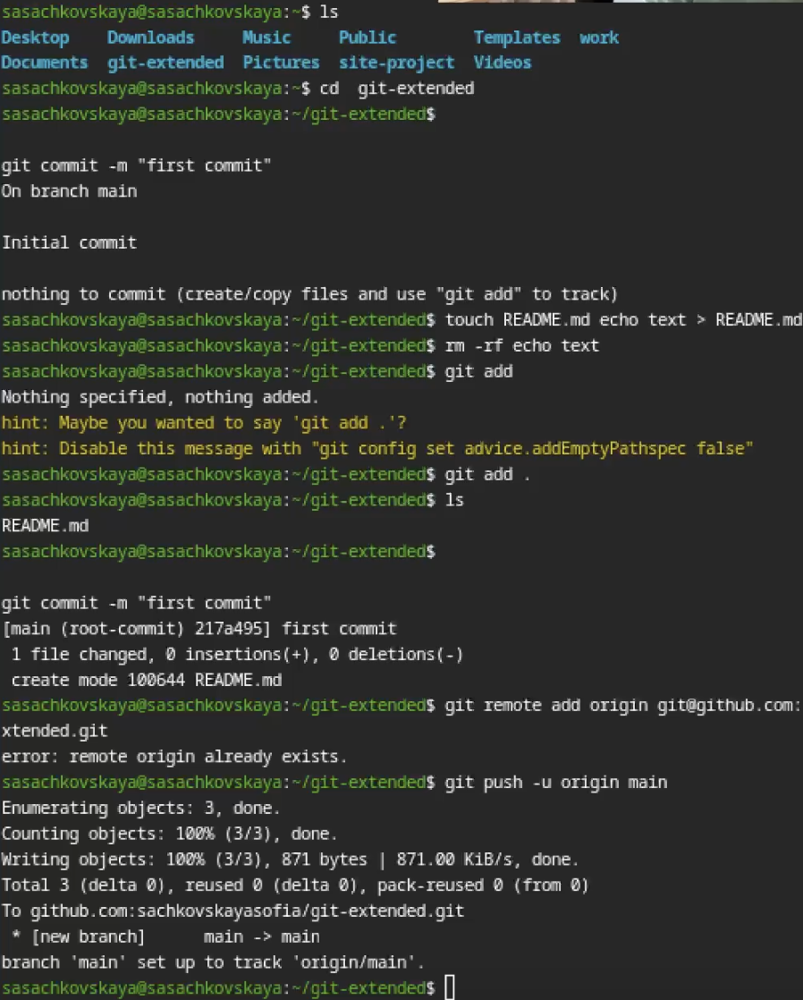
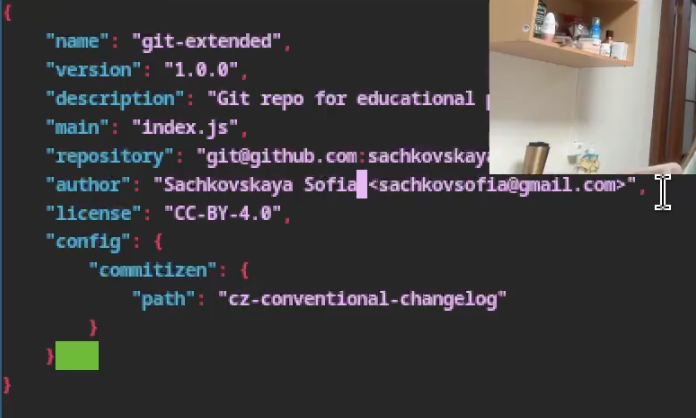
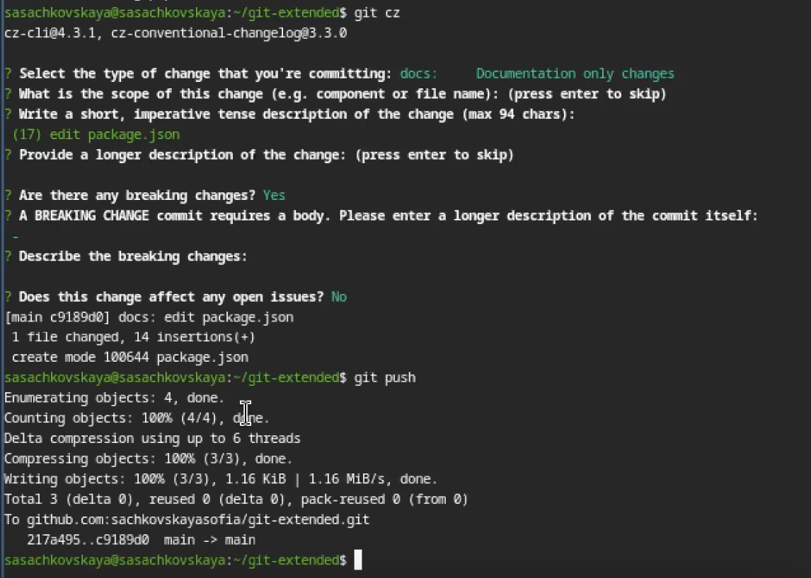
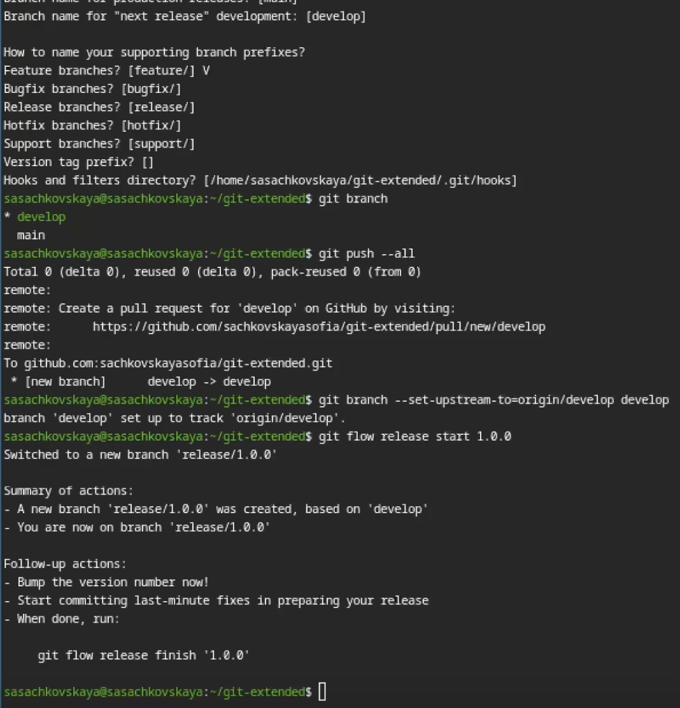
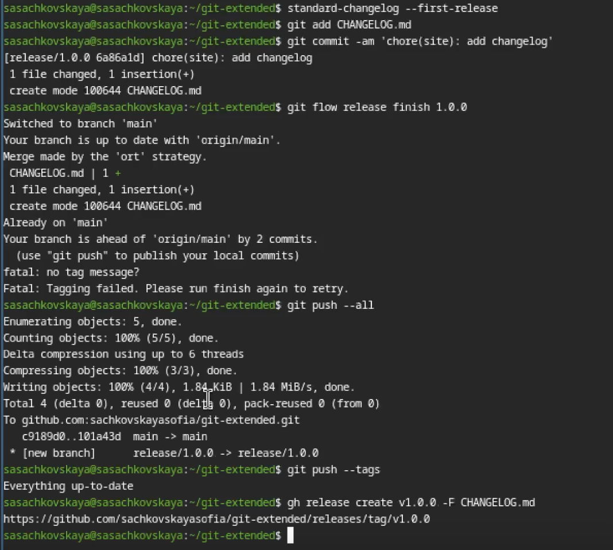
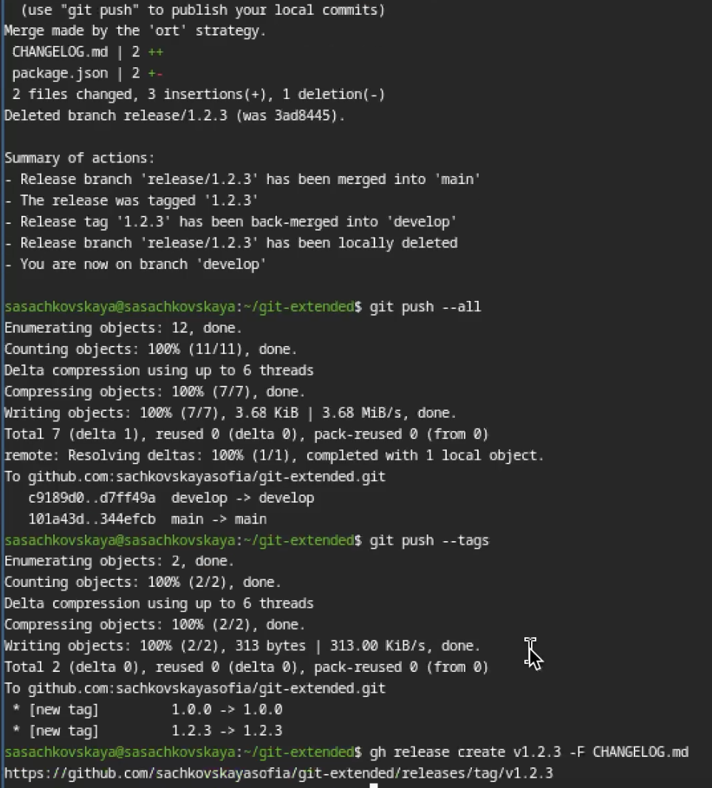

---
## Author
author:
  name: Сачковская София Александровна
  email: 1132259310@rudn.ru
  affiliation:
    - name: Российский университет дружбы народов
      country: Российская Федерация
      postal-code: 117198
      city: Москва
      address: ул. Миклухо-Маклая, д. 6
## Title
title: Лабораторная работа №4
subtitle: Продвинутое использование git
license: CC BY
date: today
date-format: "YYYY-MM-DD" # Example: 2025-09-06
lang: ru
format:
  beamer:
    pdf-engine: xelatex
    theme: Madrid
    colortheme: dolphin
    aspectratio: 169
  revealjs:
    theme: simple
    slide-number: true
mainfont: "Liberation Serif"
sansfont: "Liberation Sans"
monofont: "Liberation Mono"
---

# Информация

---

## Докладчик

:::::::::::::: {.columns align=center}
::: {.column width="70%"}

  * Сачковская София Александровна
  * студент НКАбд-06-25
  * Российский университет дружбы народов им. П. Лумумбы
  * [1132259310@rudn.ru]
  * <https://github.com/sachkovskayasofia>

:::
::: {.column width="30%"}

:::
::::::::::::::

---

# Вводная часть

---

## Актуальность

В ходе выполнения индивидуального проекта студентам потребуется продвинутое использование git

---

## Объект и предмет исследования

Продвинутое использование git

---

## Цели и задачи

Получение навыков правильной работы с репозиториями git.

---

# Задание

Выполнить работу для тестового репозитория.
Преобразовать рабочий репозиторий в репозиторий с git-flow и conventional commits.

---

# Теоретическое введение

    Рабочий процесс Gitflow Workflow. Будем описывать его с использованием пакета git-flow.

Общая информация

    Gitflow Workflow опубликована и популяризована Винсентом Дриссеном.
    Gitflow Workflow предполагает выстраивание строгой модели ветвления с учётом выпуска проекта.
    Данная модель отлично подходит для организации рабочего процесса на основе релизов.
    Работа по модели Gitflow включает создание отдельной ветки для исправлений ошибок в рабочей среде.
    Последовательность действий при работе по модели Gitflow:
        Из ветки master создаётся ветка develop.
        Из ветки develop создаётся ветка release.
        Из ветки develop создаются ветки feature.
        Когда работа над веткой feature завершена, она сливается с веткой develop.
        Когда работа над веткой релиза release завершена, она сливается в ветки develop и master.
        Если в master обнаружена проблема, из master создаётся ветка hotfix.
        Когда работа над веткой исправления hotfix завершена, она сливается в ветки develop и master.

---

# Выполнение лабораторной работы

---

Устанавливаю nodejs, пакетный менеджер для него pnpm и gitflow. (рис. -@fig:001)

{#fig:001 width=70%}

---

Устаналиваю через pnpm commitizen и standard-changelog. (рис. -@fig:002)

{#fig:002 width=70%}

---

Создаю новый репозиторий и делаю там первый коммит. (рис. -@fig:003)

{#fig:003 width=70%}

---

Инициализирую и конфигурирую общепринятые коммиты в созданной директории через редактирование package.json. (рис. -@fig:004)

{#fig:004 width=70%}

---

Делаю снимок изменений, создаю коммит и отправляю на удаленный репозиторий. (рис. -@fig:005)

{#fig:005 width=70%}

---

Инициализирую в репозитории git flow и создаю 1 релиз в только что созданной ветке develop. (рис. -@fig:006)

{#fig:006 width=70%}

---

Создаю список изменений через standard changelog, заканчиваю релиз и выгружаю на удаленный репозиторий изменения. (рис. -@fig:007)

{#fig:007 width=70%}

---

Инициализирую ветку feature для работы над новой функциональностью, готовлю релиз и загружаю на github. (рис. -@fig:008)

{#fig:008 width=70%}

---

# Выводы

Я получила навыки правильной работы с репозиториями git

---

# Список литературы{.unnumbered}

::: {#refs}
:::
