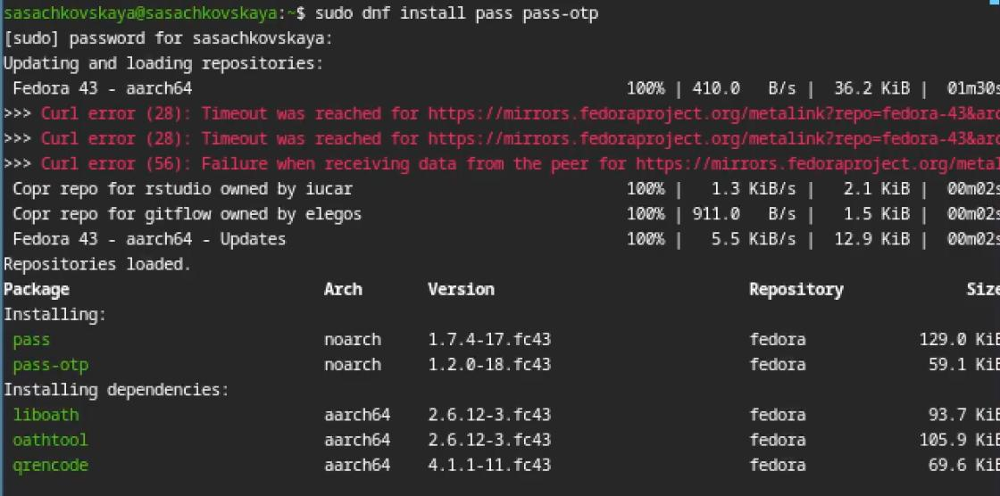
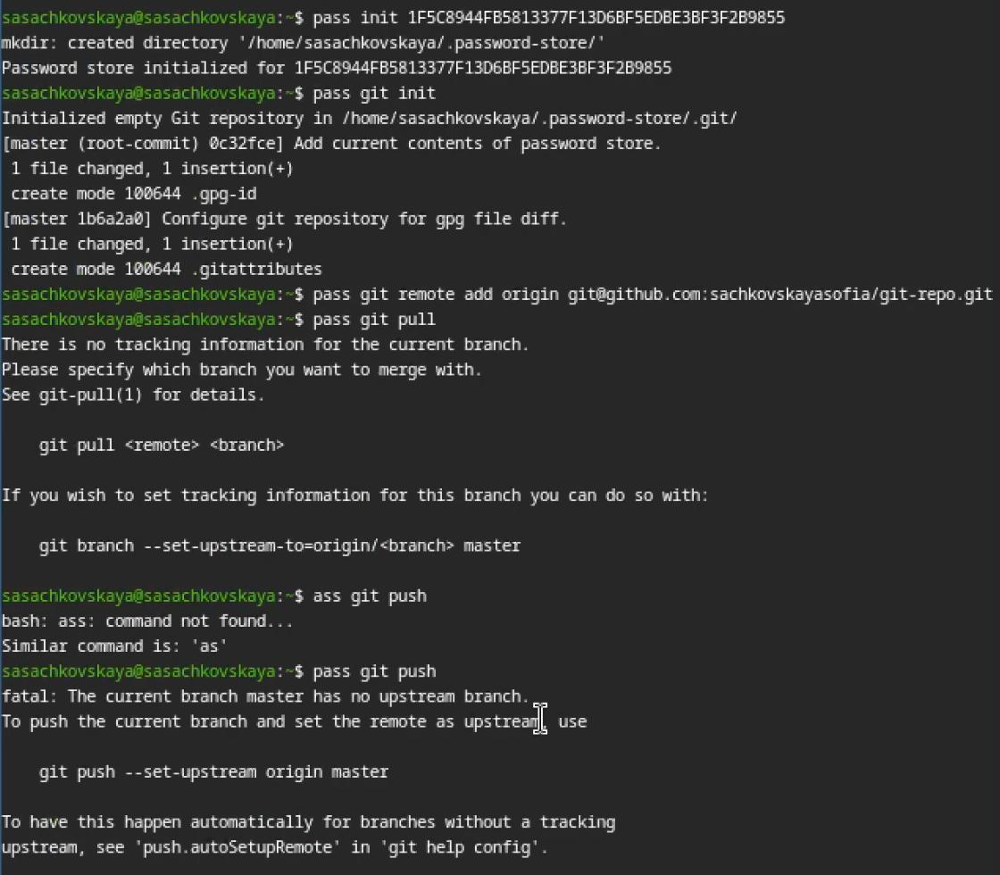
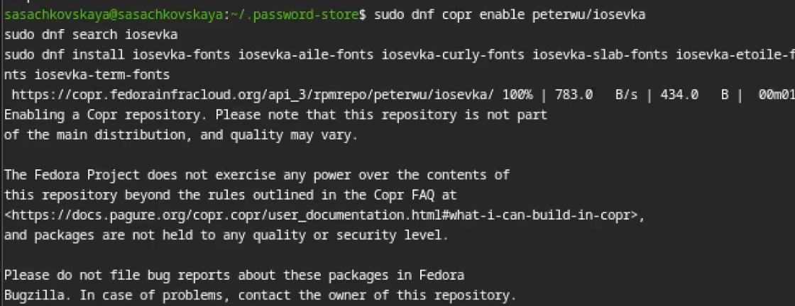
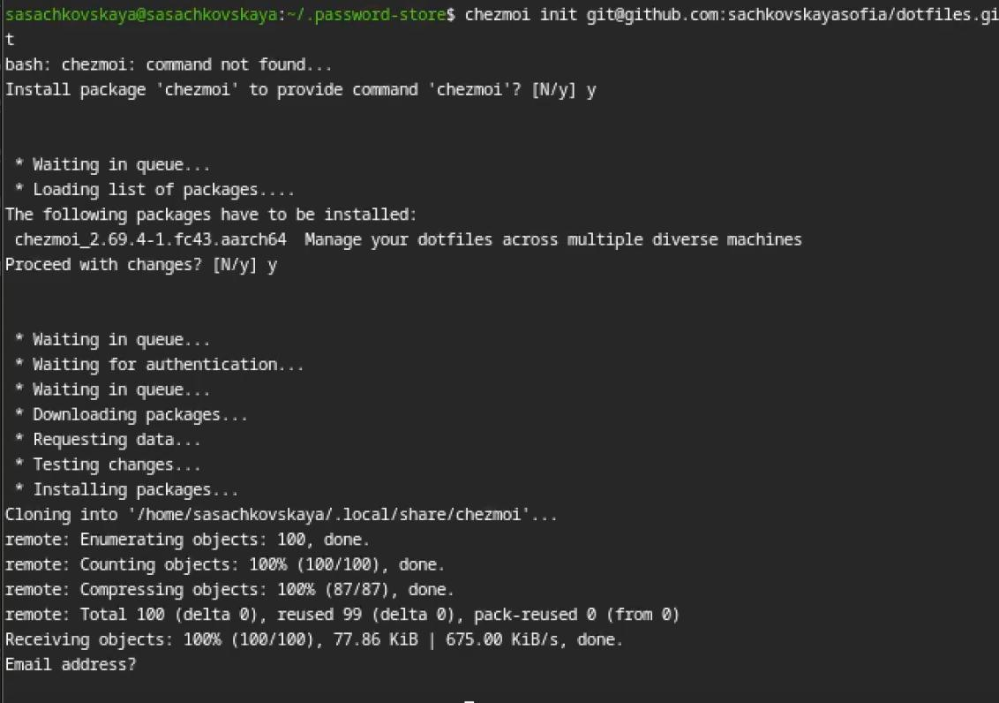
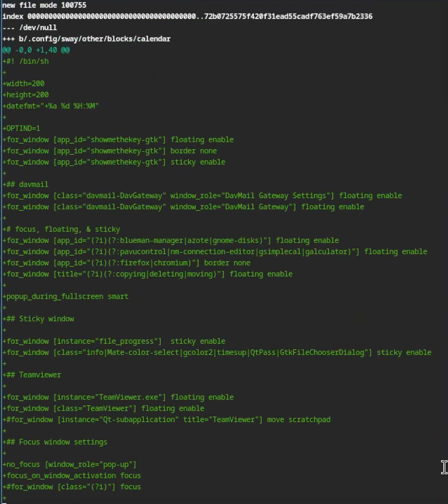
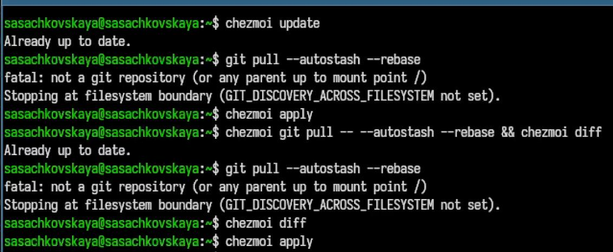
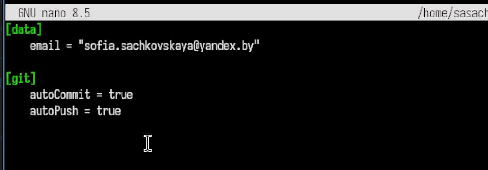

---
## Author
author:
  name: Сачковская София Александровна
  email: 1132259310@rudn.ru
  affiliation:
    - name: Российский университет дружбы народов
      country: Российская Федерация
      postal-code: 117198
      city: Москва
      address: ул. Миклухо-Маклая, д. 6
## Title
title: Лабораторная работа № 5
subtitle: Архитектура компьютера и Операционные системы
license: CC BY
date: today
date-format: "YYYY-MM-DD" # Example: 2025-09-06
lang: ru
format:
  beamer:
    pdf-engine: xelatex
    theme: Madrid
    colortheme: dolphin
    aspectratio: 169
  revealjs:
    theme: simple
    slide-number: true
mainfont: "Liberation Serif"
sansfont: "Liberation Sans"
monofont: "Liberation Mono"
---

# Информация

---

## Докладчик

:::::::::::::: {.columns align=center}
::: {.column width="70%"}

  * Сачковская София Александровна
  * студент НКАбд-06-25
  * Российский университет дружбы народов им. П. Лумумбы
  * [1132259310@rudn.ru]
  * <https://github.com/sachkovskayasofia>

:::
::: {.column width="30%"}

:::
::::::::::::::

---

# Вводная часть

---

## Актуальность

Настройка и знакомство с pass, gopass, native messaging, chezmoi является очень важной частью обучения студента компьютерных наук.В ходе работы он обучится использованию данными утилитами,  и синхронизации их с гит

---

## Объект и предмет исследования

Настройка и знакомство с pass, gopass, native messaging, chezmoi. Обучиться использованию данными утилитами, синхронизировать их с гит

---

## Цели и задачи

Настройка и знакомство с pass, gopass, native messaging, chezmoi. Обучиться использованию данными утилитами, синхронизировать их с гит

---

# Задание

1. Установка необходимого ПО
2. Установка и настройка pass
3. Настройка интерфейса с браузером
4. Сохранение пароля
5. Установка и настройка chezmoi
6. Выполнение ежедневных операций с chezmoi

---

# Теоретическое введение

Менеджер паролей pass — программа, сделанная в рамках идеологии Unix. Также носит название стандартного менеджера паролей для Unix (The standard Unix password manager).
1.1 Основные свойства
    Данные хранятся в файловой системе в виде каталогов и файлов.
    Файлы шифруются с помощью GPG-ключа.
1.2 Структура базы паролей
    Структура базы может быть произвольной, если Вы собираетесь использовать её напрямую, без промежуточного программного обеспечения. Тогда семантику структуры базы данных Вы держите в своей голове.
    Если же необходимо использовать дополнительное программное обеспечение, необходимо семантику заложить в структуру базы паролей.
chezmoi используется для управления файлами конфигурации домашнего каталога пользователя. 
Конфигурация chezmoi
    2.2.1 Рабочие файлы
    Состояние файлов конфигурации сохраняется в каталоге ~/.local/share/chezmoi. Он является клоном вашего репозитория dotfiles.
    Файл конфигурации ~/.config/chezmoi/chezmoi.toml (можно использовать также JSON или YAML) специфичен для локальной машины.
    Файлы, содержимое которых одинаково на всех ваших машинах, дословно копируются из исходного каталога.
    Файлы, которые варьируются от машины к машине, выполняются как шаблоны, обычно с использованием данных из файла конфигурации локальной машины для настройки конечного содержимого, специфичного для локальной машины.

---

# Выполнение лабораторной работы

---

Устанавливаю pass. (рис. -@fig:001)

{#fig:001 width=70%}

---

Инициализирую pass на машине и делаю первый пароль. (рис. -@fig:002)

{#fig:002 width=70%}

---

Устанавливаю дополнительное ПО и шрифты. (рис. -@fig:003)

{#fig:003 width=70%}

---

Инициализирую chezmoi с указанием на указанный в лабораторной работы репозиторий. (рис. -@fig:004)

{#fig:004 width=70%}

---

Применяю конфиг. (рис. -@fig:005)

{#fig:005 width=70%}

---

Проверяю изменения в удаленном репозитории (рис. -@fig:006)

{#fig:006 width=70%}

---

Отключаю автоматические сохранение изменений. (рис. -@fig:007)

{#fig:007 width=70%}

---

# Выводы

Я познакомилась с pass, gopass, native messaging, chezmoi. Научилась использованию данными утилитами, синхронизировала их с гит.

---

# Список литературы{.unnumbered}

::: {#refs}
:::
