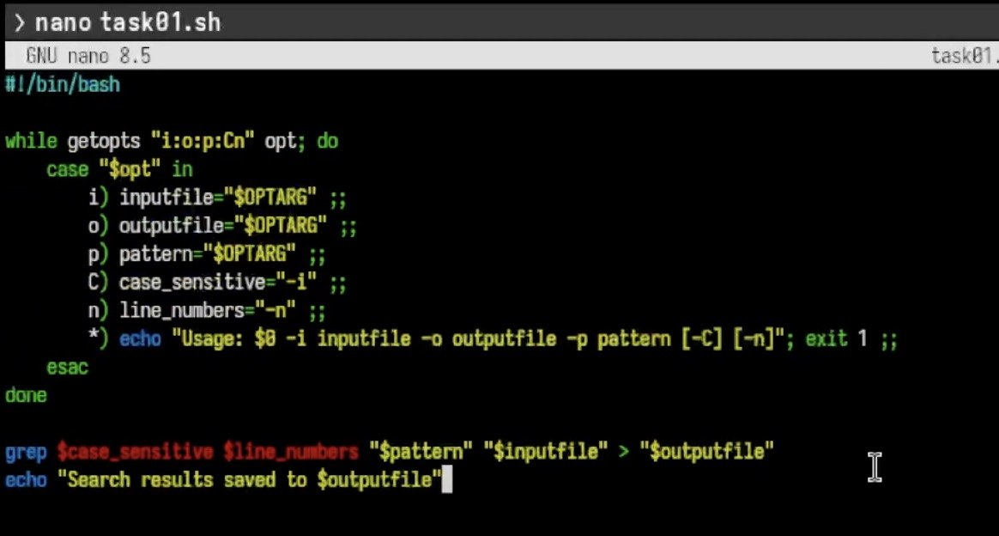
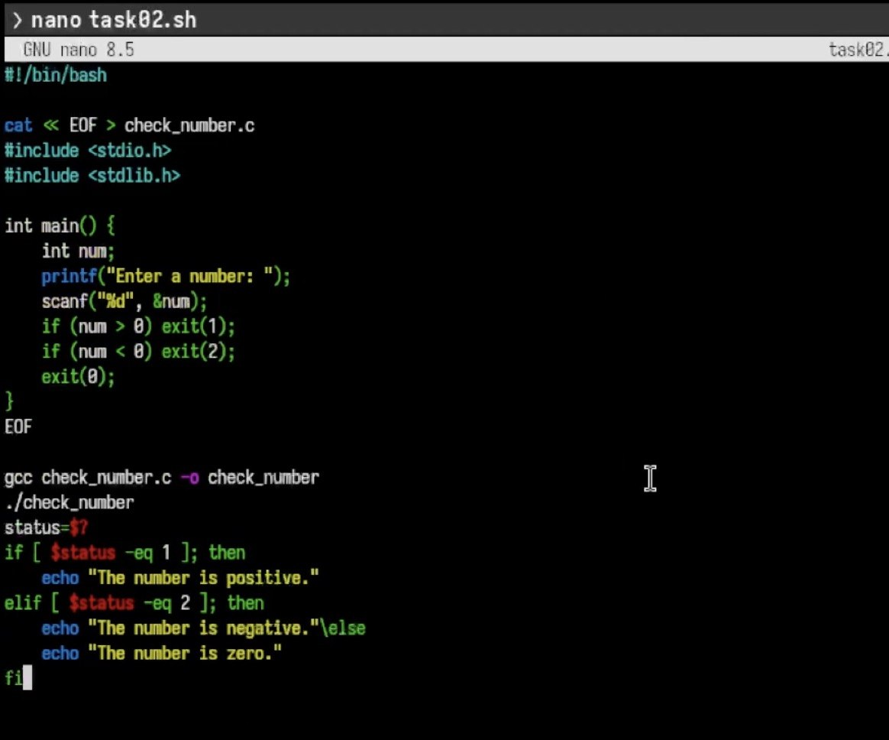
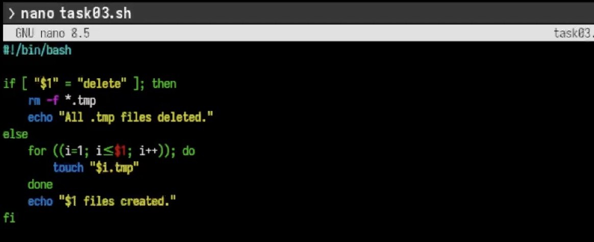
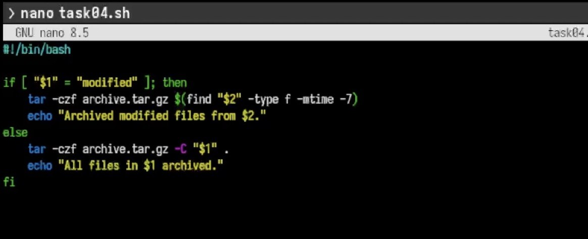

---
## Author
author:
  name: Сачковская София Александровна
  email: 1132259310@rudn.ru
  affiliation:
    - name: Российский университет дружбы народов
      country: Российская Федерация
      postal-code: 117198
      city: Москва
      address: ул. Миклухо-Маклая, д. 6

## Title
title: "Лабораторная работа № 13"
subtitle: "Архитектура компьютеров и операционные системы"
license: "CC BY"
---

# Цель работы

Изучить основы программирования в оболочке ОС UNIX. Научится писать более
сложные командные файлы с использованием логических управляющих конструкций
и циклов.

# Задание

1. Используя команды getopts grep, написать командный файл, который анализирует
командную строку с ключами:
– -iinputfile — прочитать данные из указанного файла;
– -ooutputfile — вывести данные в указанный файл;
– -pшаблон — указать шаблон для поиска;
– -C — различать большие и малые буквы;
– -n — выдавать номера строк.
а затем ищет в указанном файле нужные строки, определяемые ключом -p.
2. Написать на языке Си программу, которая вводит число и определяет, является ли оно
больше нуля, меньше нуля или равно нулю. Затем программа завершается с помощью
функции exit(n), передавая информацию в о коде завершения в оболочку. Команд-
ный файл должен вызывать эту программу и, проанализировав с помощью команды
$?, выдать сообщение о том, какое число было введено.
3. Написать командный файл, создающий указанное число файлов, пронумерованных
последовательно от 1 до 𝑁 (например 1.tmp, 2.tmp, 3.tmp,4.tmp и т.д.). Число файлов,
которые необходимо создать, передаётся в аргументы командной строки. Этот же ко-
мандный файл должен уметь удалять все созданные им файлы (если они существуют).
4. Написать командный файл, который с помощью команды tar запаковывает в архив
все файлы в указанной директории. Модифицировать его так, чтобы запаковывались
только те файлы, которые были изменены менее недели тому назад (использовать
команду find).

# Теоретическое введение

Bash (Bourne Again Shell) — это мощная командная оболочка Unix, которая используется для выполнения различных задач в терминале. Bash предоставляет интерактивный интерфейс, в котором пользователи могут вводить команды, а затем получать результаты. Она также поддерживает скрипты оболочки, которые представляют собой текстовые файлы, содержащие последовательность команд Bash для автоматизации задач. 
Bash широко используется в средах Unix и Linux, а также поддерживается Windows с помощью подсистемы Windows для Linux (WSL). Перечислим основные возможности этой оболочки.
    Обработка команд. Bash может обрабатывать как простые, так и сложные команды. Простые состоят из одного действия и, возможно, некоторых аргументов. Сложные команды могут содержать несколько простых, объединенных с помощью операторов конвейера (`|`), перенаправления ввода и вывода (`<`, `>`, `>>`), условных операторов (`if/else`, `case/esac`, `while/do`). О них мы расскажем позже.
    Расширенный ввод, редактирование строк. Оболочка предоставляет функции расширенного ввода, такие как автодополнение, которое предлагает возможные варианты завершения команд и имен файлов по мере их ввода. Она также поддерживает историю, позволяя пользователям просматривать ранее введенные команды, а затем повторно их использовать.
    Возможность создания и запуска скриптов. Скрипты оболочки — это текстовые файлы, содержащие последовательность команд. Их можно создавать с помощью текстового редактора, а затем запускать в терминале, что дает возможность пользователям автоматизировать задачи и управлять системой. Скрипты могут содержать условные операторы, циклы, функции для обеспечения дополнительной гибкости и контроля.

# Выполнение лабораторной работы

1.  Используя команды getopts grep, написать командный файл, который анализирует
командную строку с ключами:
– -iinputfile — прочитать данные из указанного файла;
– -ooutputfile — вывести данные в указанный файл;
– -pшаблон — указать шаблон для поиска;
– -C — различать большие и малые буквы;
– -n — выдавать номера строк.
а затем ищет в указанном файле нужные строки, определяемые ключом -p.(рис. @fig:001).

{#fig:001 width=70%}

2.  Написать на языке Си программу, которая вводит число и определяет, является ли оно
больше нуля, меньше нуля или равно нулю. Затем программа завершается с помощью
функции exit(n), передавая информацию в о коде завершения в оболочку. Команд-
ный файл должен вызывать эту программу и, проанализировав с помощью команды
$?, выдать сообщение о том, какое число было введено. (рис. @fig:002).

{#fig:002 width=70%} 

3. Написать командный файл, создающий указанное число файлов, пронумерованных
последовательно от 1 до 𝑁 (например 1.tmp, 2.tmp, 3.tmp,4.tmp и т.д.). Число файлов,
которые необходимо создать, передаётся в аргументы командной строки. Этот же ко-
мандный файл должен уметь удалять все созданные им файлы (если они существуют). (рис. @fig:003).

{#fig:003 width=70%} 

4. Написать командный файл, который с помощью команды tar запаковывает в архив
все файлы в указанной директории. Модифицировать его так, чтобы запаковывались
только те файлы, которые были изменены менее недели тому назад (использовать
команду find). (рис. @fig:004). 

{#fig:004 width=70%} 

# Контрольные вопросы

1. Каково предназначение команды getopts?
Осуществляет синтаксический анализ командной строки, выделяя флаги, и используется для объявления переменных. Синтаксис команды следующий: getopts option-string variable. Флаги – это опции командной строки, обычно помеченные знаком минус; Например, -F является флагом для команды ls -F. Иногда эти флаги имеют аргументы, связанные с ними. Программы интерпретируют эти флаги, соответствующим образом изменяя свое поведение. Строка опций option-string — это список возможных букв и чисел соответствующего флага. Если ожидается, что некоторый флаг будет сопровождаться некоторым аргументом, то за этой буквой должно следовать двоеточие. Соответствующей переменной присваивается буква данной опции. Если команда getopts может распознать аргумент, она возвращает истину. Принято включать getopts в цикл while и анализировать введенные данные с помощью оператора case. Предположим, необходимо распознать командную строку следующего формата: testprog -ifile_in.txt -ofile_out.doc -L -t -r Вот как выглядит использование оператора getopts в этом случае: while getopts o:i:Ltr optletter do case $optletter in o) oflag=1; oval=$OPTARG;; i) iflag=1; ival=$OPTARG;; L) Lflag=1;; t) tflag=1;; r) rflag=1;; *) echo Illegal option $optletter esac done Функция getopts включает две специальные переменные среды – OPTARG и OPTIND. Если ожидается дополнительное значение, то OPTARG устанавливается в значение этого аргумента (будет равна file_in.txt для опции i и file_out.doc для опции o) . OPTIND является числовым индексом на упомянутый аргумент. Функция getopts также понимает переменные типа массив, следовательно, можно использовать ее в функции не только для синтаксического анализа аргументов функций, но и для анализа введенных пользователем данных.

2. Какое отношение метасимволы имеют к генерации имён файлов?
При перечислении имён файлов текущего каталога можно использовать следующие символы: − соответствует произвольной, в том числе и пустой строке; ? − соответствует любому одинарному символу; [c1-c2] − соответствует любому символу, лексикографически находящемуся между символами с1 и с2. Например, echo * − выведет имена всех файлов текущего каталога, что представляет собой простейший аналог команды ls; ls .c − выведет все файлы с последними двумя символами, совпадающими с .c. echo prog.? − выведет все файлы, состоящие из пяти или шести символов, первыми пятью символами которых являются prog.. [a-z] − соответствует произвольному имени файла в текущем каталоге, начинающемуся с любой строчной буквы латинского алфавита.

3. Какие операторы управления действиями вы знаете?
Часто бывает необходимо обеспечить проведение каких-либо действий циклически и управление дальнейшими действиями в зависимости отрезультатов проверки некоторого условия. Для решения подобных задач язык программирования bash предоставляет возможность использовать такие управляющие конструкции, как for, case, if и while. С точки зрения командного процессора эти управляющие конструкции являются обычными командами и могут использоваться как при создании командных файлов, так и при работе в интерактивном режиме. Команды, реализующие подобные конструкции, по сути, являются операторами языка программирования bash. Поэтому при описании языка программирования bash термин оператор будет использоваться наравне с термином команда. Команды ОС UNIX возвращают код завершения, значение которого может быть использовано для принятия решения о дальнейших действиях. Команда test, например, создана специально для использования в командных файлах. Единственная функция этой команды заключается в выработке кода завершения.

4. Какие операторы используются для прерывания цикла?
Два несложных способа позволяют вам прерывать циклы в оболочке bash. Команда break завершает выполнение цикла, а команда continue завершает данную итерацию блока операторов. Команда break полезна для завершения цикла while в ситуациях, когда условие перестаёт быть правильным. Команда continue используется в ситуациях, когда больше нет необходимости выполнять блок операторов, но вы можете захотеть продолжить проверять данный блок на других условных выражениях.

5. Для чего нужны команды false и true?
Следующие две команды ОС UNIX используются только совместно с управляющими конструкциями языка программирования bash: это команда true, которая всегда возвращает код завершения, равный нулю (т.е. истина), и команда false, которая всегда возвращает код завершения, не равный нулю (т. е. ложь).

6. Что означает строка if test -f man$s/$i.$s, встреченная в командном файле?
Строка if test -f man$s/$i.$s проверяет, существует ли файл man$s/$i.$s и является ли этот файл обычным файлом. Если данный файл является каталогом, то команда вернет нулевое значение (ложь).

7. Объясните различия между конструкциями while и until.
Выполнение оператора цикла while сводится к тому, что сначала выполняется последовательность команд (операторов), которую задаёт список-команд в строке, содержащей служебное слово while, а затем, если последняя выполненная команда из этой последовательности команд возвращает нулевой код завершения (истина), выполняется последовательность команд (операторов), которую задаёт список-команд в строке, содержащей служебное слово do, после чего осуществляется безусловный переход на начало оператора цикла while. Выход из цикла будет осуществлён тогда, когда последняя выполненная команда из последовательности команд (операторов), которую задаёт список-команд в строке, содержащей служебное слово while, возвратит ненулевой код завершения (ложь). При замене в операторе цикла while служебного слова while на until условие, при выполнении которого осуществляется выход из цикла, меняется на противоположное. В остальном оператор цикла while и оператор цикла until идентичны.

# Выводы

Мы изучили основы программирования в оболочке ОС UNIX. Научились писать более
сложные командные файлы с использованием логических управляющих конструкций
и циклов.

# Список литературы{.unnumbered}

::: {#refs}
:::
