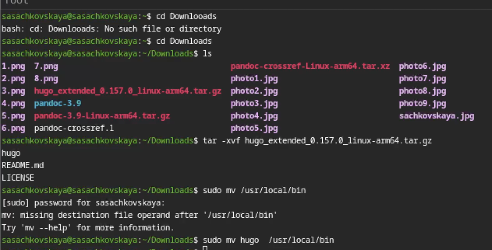
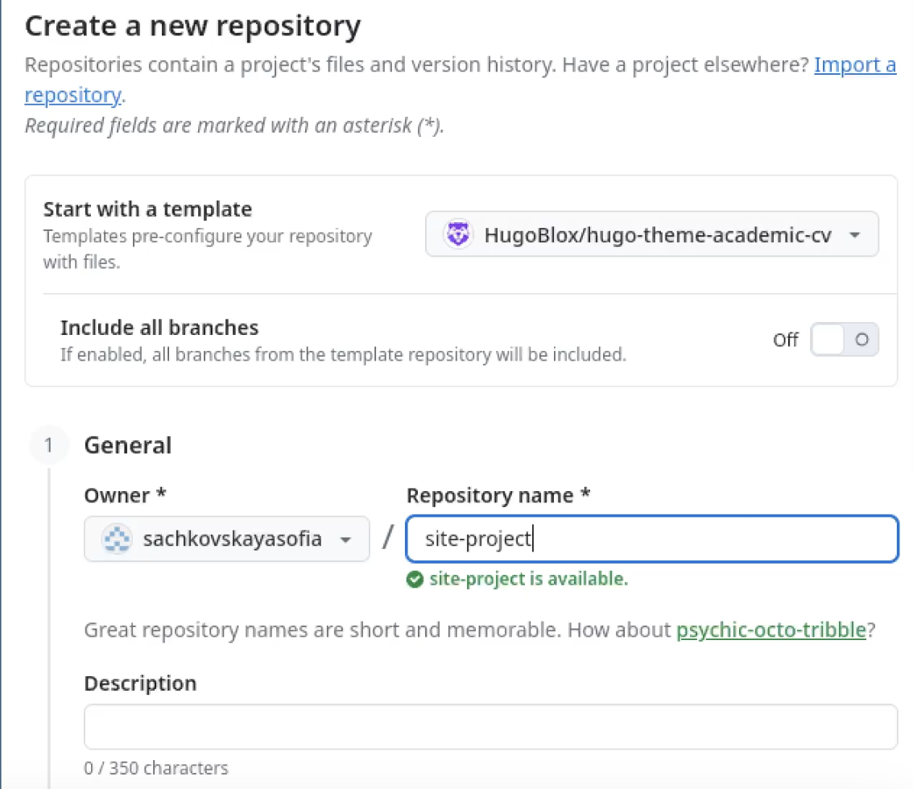
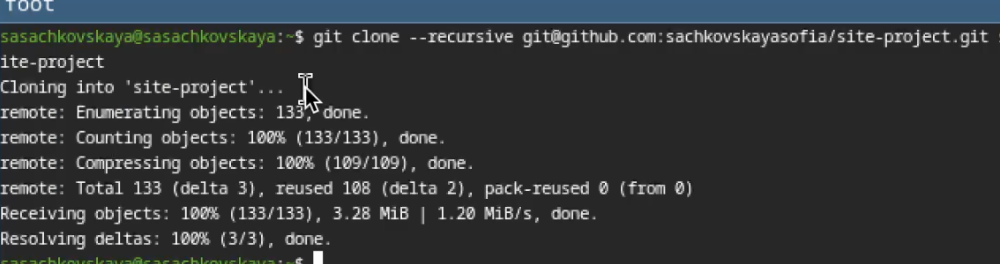
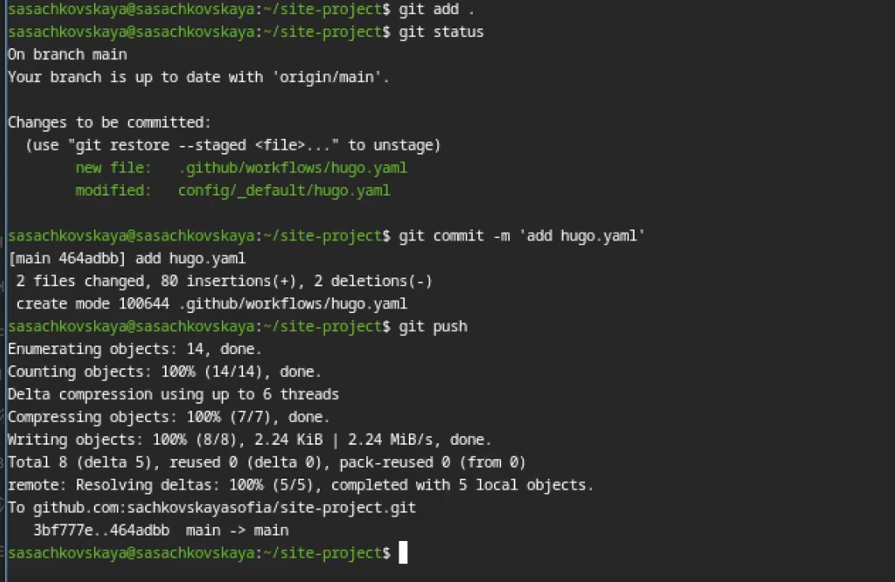
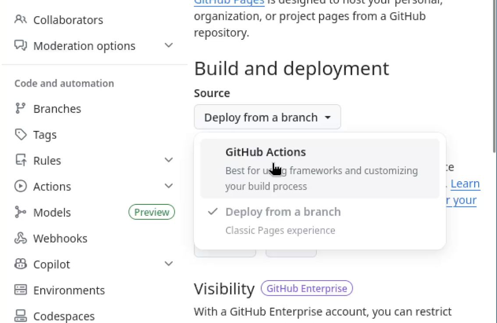

---
## Author
author:
  name: Сачковская София Александровна
  email: 1132259310@rudn.ru
  affiliation:
    - name: Российский университет дружбы народов
      country: Российская Федерация
      postal-code: 117198
      city: Москва
      address: ул. Миклухо-Маклая, д. 6

## Title
title: "1 этап индивидуального проекта"
subtitle: "Размещение на Github pages заготовки для персонального сайта"
license: "CC BY"
---

# Цель работы

Научиться размещать сайт на Github pages. Выполнить первый этап индивидуального проекта

# Задание

- Установить необходимое программное обеспечение.
- Скачать шаблон темы сайта.
- Разместить его на хостинге git.
- Установить параметр для URLs сайта.
- Разместить заготовку сайта на Github pages.

# Выполнение индивидуального проекта

Устанавливаю hugo на свою виртуальную машину и переношу исполняемый файл в директорию с пакетами. (рис. -@fig:001)

{#fig:001 width=70%}

Создаю свой репозиторий для будущего сайта, используя шаблон. (рис. -@fig:002)

{#fig:002 width=70%}

Клонирую репозиторий на свою машину и загружаю туда конфигурационный файл для сайта. (рис. -@fig:003)

{#fig:003 width=70%}

Делаю снимок изменений, создаю коммит и отправляю изменения на github. (рис. -@fig:004)

{#fig:004 width=70%}

В настройках репозитория указываю github actions. (рис. -@fig:005)

{#fig:005 width=70%}

Проверяю работоспособность сайта. (рис. -@fig:006)

{#fig:006 width=70%}

# Выводы

Я научилась размещать сайт на Github pages. Выполнила первый этап индивидуального проекта

# Список литературы{.unnumbered}

::: {#refs}
:::
