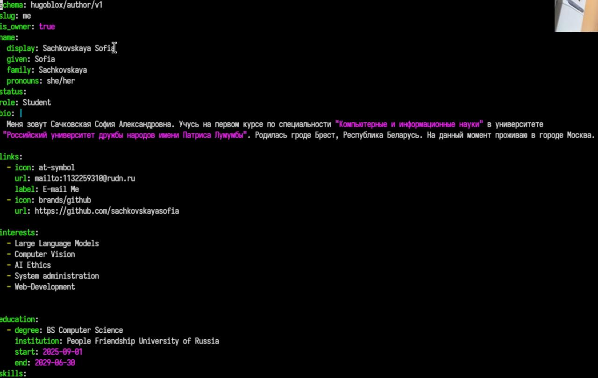
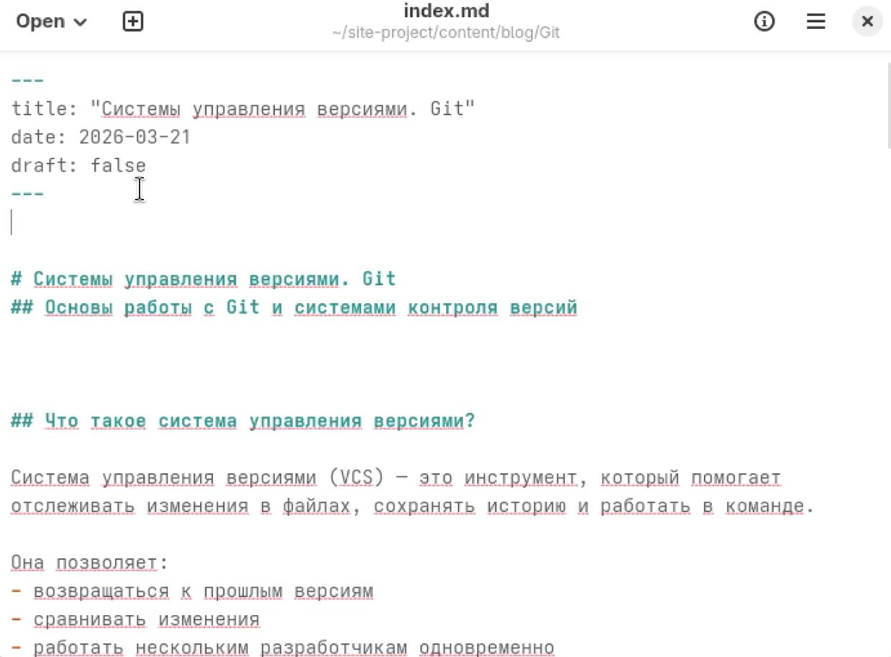
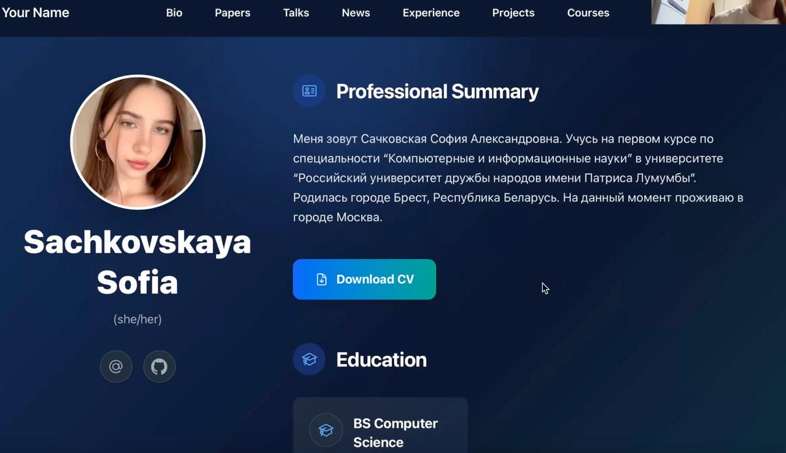

---
## Author
author:
  name: Сачковская София Александровна
  email: 1132259310@rudn.ru
  affiliation:
    - name: Российский университет дружбы народов
      country: Российская Федерация
      postal-code: 117198
      city: Москва
      address: ул. Миклухо-Маклая, д. 6

## Title
title: "Индивидуальный проект 2 этап"
subtitle: "Архитектура компьютеров и операционные системы"
license: "CC BY"
---
# Цель работы

Продолжить работу с сайтом, редактировать его в соответствии с требованиями, добавить данные о себе на сайт.

# Задание

1. Разместить фотографию владельца сайта.
2. Разместить краткое описание владельца сайта (Biography).
3. Добавить информацию об интересах (Interests).
4. Добавить информацию об образовании (Education).
5. Сделать пост по прошедшей неделе.
6. Добавить пост на тему по выбору: Управление версиями. Git. Непрерывная интеграция и непрерывное развертывание (CI/CD).

# Выполнение индивидуального проекта

Размещаю свою фотографию, информацию об интересах,информацию об образованию  (рис. -@fig:001)

{#fig:001 width=70%}

Делаю пост о прошедшей неделе (рис. -@fig:002)

{#fig:002 width=70%}

Добавляю пост на тему:"Управление версиями. Git" (рис. -@fig:003)

{#fig:003 width=70%}

Проверка изменений на сайте. (рис. -@fig:004)

{#fig:004 width=70%}

# Выводы

Мы продолжили работу с сайтом, редактировали его в соответствии с требованиями, добавили данные о себе на сайт.

# Список литературы{.unnumbered}

::: {#refs}
:::
