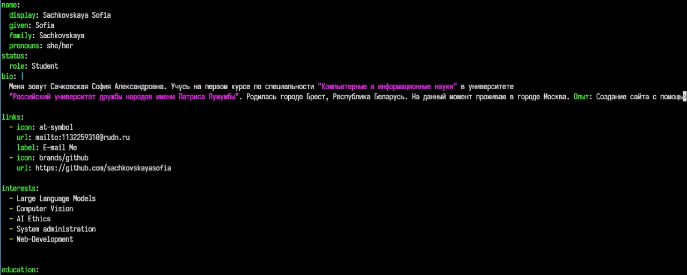
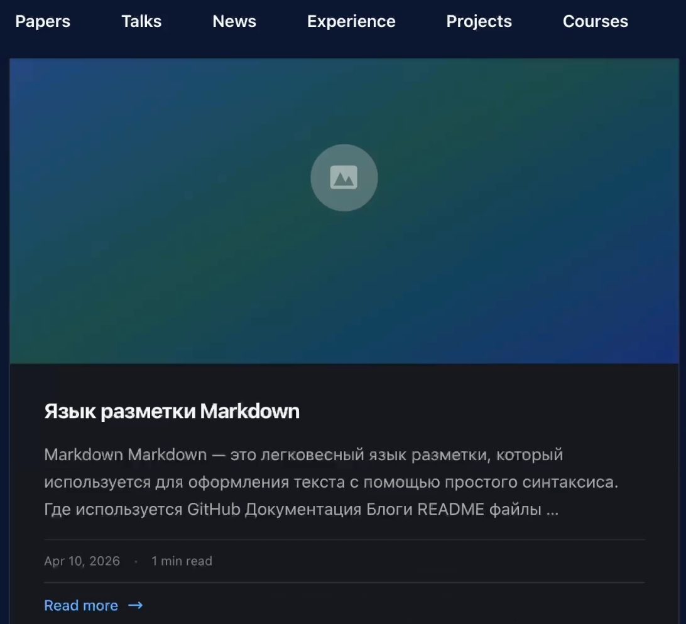
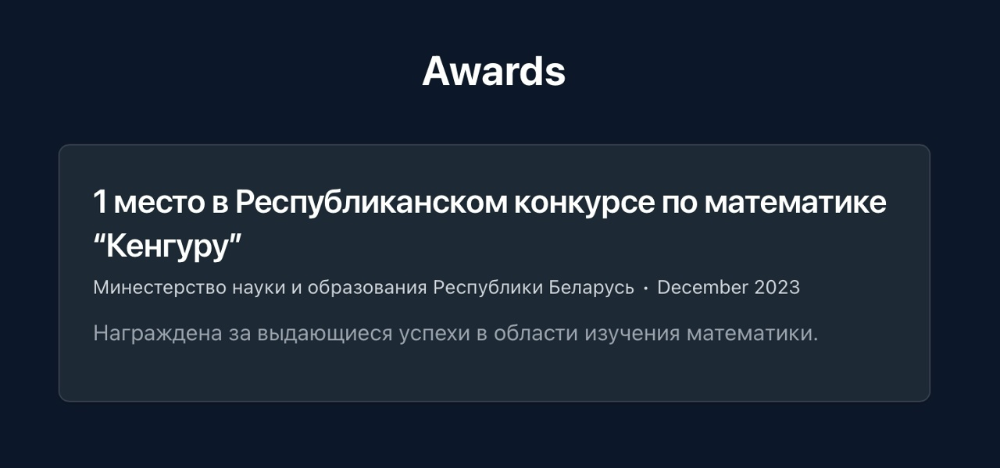

---
## Author
author:
  name: Сачковская София Александровна
  email: 1132259310@rudn.ru
  affiliation:
    - name: Российский университет дружбы народов
      country: Российская Федерация
      postal-code: 117198
      city: Москва
      address: ул. Миклухо-Маклая, д. 6

## Title
title: "Индивидуальный проект 3 этап"
subtitle: "Архитектура компьютеров и операционные системы"
license: "CC BY"
---

# Цель работы

Продолжить работу с сайтом, добавить личные достижения

# Задание

1. Добавить информацию о навыках (Skills).
2. Добавить информацию об опыте (Experience).
3. Добавить информацию о достижениях (Accomplishments).
4. Сделать пост по прошедшей неделе.
5. Добавить пост на тему по выбору: Легковесные языки разметки. Языки разметки. LaTeX. Язык разметки Markdown.

# Выполнение индивидуального проекта

Добавляю навыки и достижения (рис. -@fig:001)

{#fig:001 width=70%}

Проверяю отображение двух новых постов на сайте. (рис. -@fig:002)

{#fig:002 width=70%}

Проверяю отображение своих достижений на сайте. (рис. -@fig:003)

{#fig:003 width=70%}

# Выводы

Мы продолжили работу с сайтом, добавили личные достижения.

# Список литературы{.unnumbered}

::: {#refs}
:::
