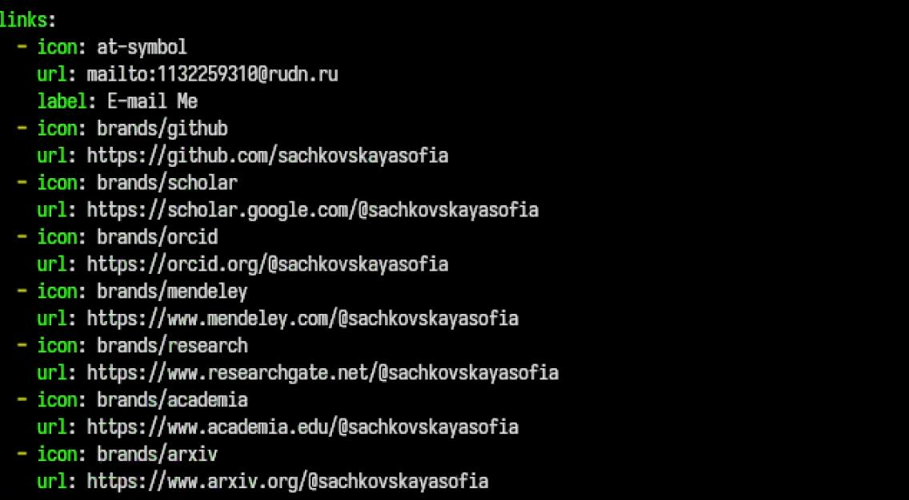
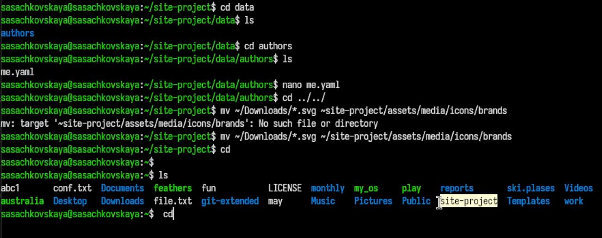
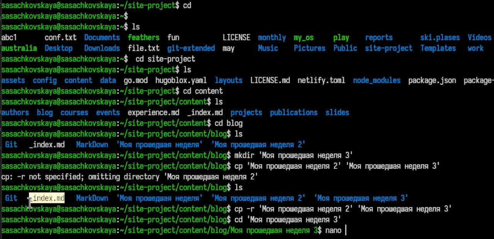

---
## Author
author:
  name: Сачковская София Александровна
  email: 1132259310@rudn.ru
  affiliation:
    - name: Российский университет дружбы народов
      country: Российская Федерация
      postal-code: 117198
      city: Москва
      address: ул. Миклухо-Маклая, д. 6
## Title
title: Индивидуальный проект 4 этап
subtitle: Архитектура компьютеров и операционные системы
license: CC BY
date: today
date-format: "YYYY-MM-DD" # Example: 2025-09-06
lang: ru
format:
  beamer:
    pdf-engine: xelatex
    theme: Madrid
    colortheme: dolphin
    aspectratio: 169
  revealjs:
    theme: simple
    slide-number: true
mainfont: "Liberation Serif"
sansfont: "Liberation Sans"
monofont: "Liberation Mono"
---

# Информация

---

## Докладчик

:::::::::::::: {.columns align=center}
::: {.column width="70%"}

  * Сачковская София Александровна
  * студент НКАбд-06-25
  * Российский университет дружбы народов им. П. Лумумбы
  * [1132259310@rudn.ru](mailto:1132259310@rudn.ru)
  * <https://github.com/sachkovskayasofia>

:::
::: {.column width="30%"}

:::
::::::::::::::

---

# Цель работы

Продолжить работу с сайтом, добавить к сайту ссылки на научные и библиометрические ресурсы, сделать пост по выбору и по прошедшей неделе.

---

# Задание

1. Зарегистрироваться на соответствующих ресурсах и разместить на них ссылки на сайте: eLibrary : https://elibrary.ru/; Google Scholar : https://scholar.google.com/; ORCID : https://orcid.org/; Mendeley : https://www.mendeley.com/; ResearchGate : https://www.researchgate.net/; Academia.edu : https://www.academia.edu/; arXiv : https://arxiv.org/; github : https://github.com/.
2. Сделать пост по прошедшей неделе.
3. Добавить пост на тему по выбору: Оформление отчёта. Создание презентаций. Работа с библиографией.

---

# Выполнение проекта

---

Изменяю исходный файл добавляя ссылки на ресурсы (рис. -@fig:001)

{#fig:001 width=70%}

---

Добавляю 2 поста про библиографию и про мою прошедшую неделю (рис. -@fig:002)

{#fig:002 width=70%}

---

Переношу векторные значки для корректного отображения ссылок в профиле. (рис. -@fig:003)

{#fig:003 width=70%}

---

Проверяю отображение на сайте. (рис. -@fig:004)

{#fig:004 width=70%}

---

# Выводы

Мы продолжили работу с сайтом, добавили к сайту ссылки на научные и библиометрические ресурсы, сделали пост по выбору и по прошедшей неделе.

---

# Список литературы{.unnumbered}

::: {#refs}
:::

