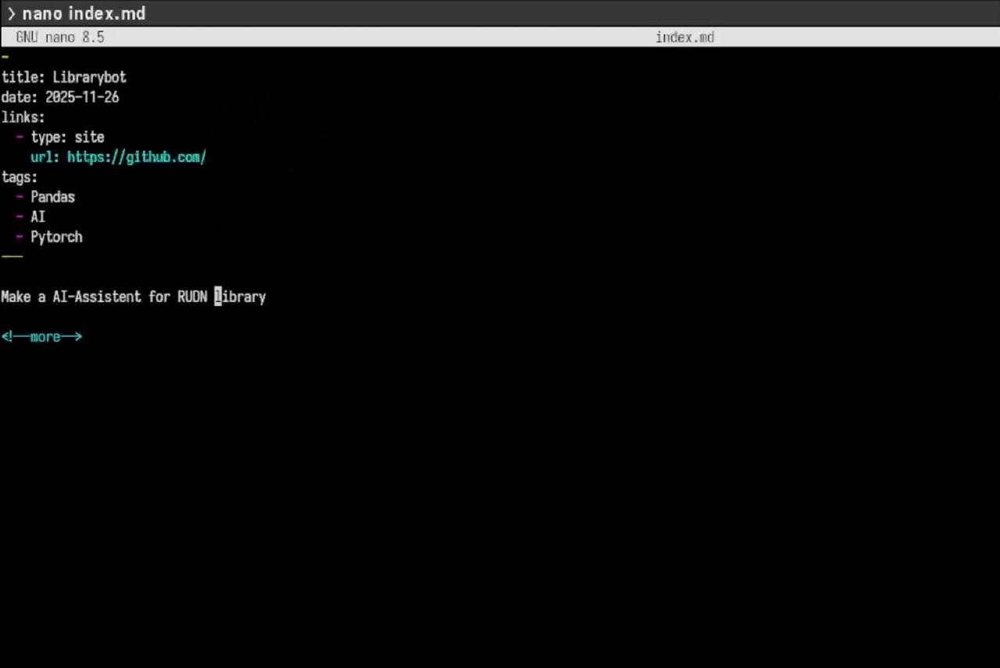
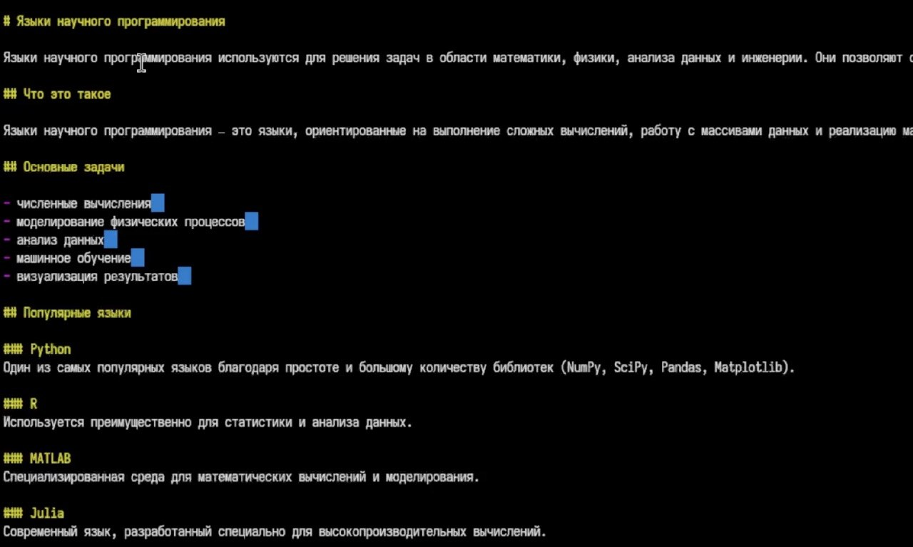
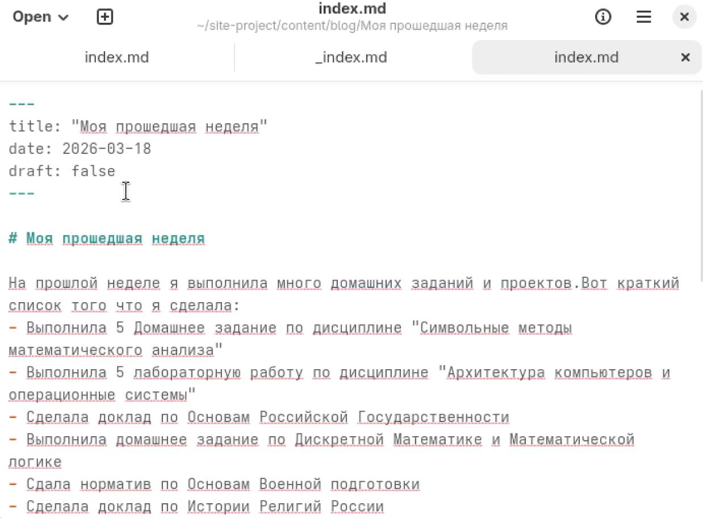
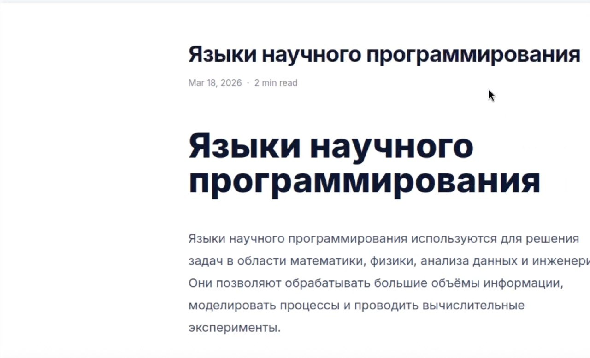

---
## Author
author:
  name: Сачковская София Александровна
  email: 1132259310@rudn.ru
  affiliation:
    - name: Российский университет дружбы народов
      country: Российская Федерация
      postal-code: 117198
      city: Москва
      address: ул. Миклухо-Маклая, д. 6

## Title
title: "Индивидуальный проект 5 этап"
subtitle: "Архитектура компьютеров и операционные системы"
license: "CC BY"
---

# Цель работы

Продолжить работу с сайтом, добавить к сайту записи для персональных проектов, сделать пост по прошлой неделе и по языкам научного программирования.

# Задание

1. Сделать записи для персональных проектов.
2. Сделать пост по прошедшей неделе.
3. Добавить пост на тему по выбору. Языки научного программирования.

# Выполнение лабораторной работы

Добавляю проект (рис. -@fig:001)

{#fig:001 width=70%}

Добавляю пост о языках научного программирования (рис. -@fig:002)

{#fig:002 width=70%}

Добавляю пост о своей прошедшей неделе (рис. -@fig:003)

{#fig:003 width=70%}

Проверяю отображение на сайте. (рис. -@fig:004)

{#fig:004 width=70%}

# Выводы

Мы продолжили работу с сайтом, добавили к сайту записи для индивидуального проекта, сделали пост по выбору и по прошедшей неделе.

# Список литературы{.unnumbered}

::: {#refs}
:::
